# Блок-схема и пакетные скрипты GitConverter

> Документ описывает алгоритм конвертации хранилища 1С в Git, порядок запуска скриптов в пакетном режиме и координаты кода.
> Основной модуль: `cfg_src/CommonModules/КонвертацияХранилища/Ext/Module.bsl` (далее — **КХ**).

---

## 1. Общая блок-схема конвейера

```mermaid
flowchart TD
    Start["Кнопка «Запустить конвертацию»<br/>Форма ХранилищаКонфигураций.ФормаЭлемента<br/>Module.bsl:140-145"] --> S1["ЗапуститьКонвертациюНаСервере()<br/>Module.bsl:452-484"]

    S1 --> BG1["Фоновое задание:<br/>КонвертацияХранилища.ВыполнитьКонвертацию<br/>КХ:20"]

    BG1 --> C1{Проверки:<br/>Полученные версии,<br/>состояния заданий,<br/>удаление временных данных<br/>КХ:26-32}

    C1 --> C2{ПоследняяВерсия = 0?<br/>КХ:41}
    C2 -- Да --> TMP["Создание временной базы<br/>СоздатьФайловуюИнформационнуюБазу<br/>КХ:97-113, 2497"]
    TMP --> REP["Отчёт по версиям хранилища<br/>СформироватьОтчетПоВерсиямХранилища<br/>КХ:121, 2700"]
    REP --> LOAD["Загрузка версий в справочник<br/>ЗагрузитьВерсииИзОтчета<br/>КХ:123"]
    LOAD --> C2
    C2 -- Нет --> LOOP

    LOOP["Цикл по версиям (КХ:198-239)<br/>для каждой версии со статусом 'Пустая ссылка'"] --> LOCK["Блокировка версии<br/>КХ:204-208"]
    LOCK --> STATE1["Состояние = ПолучениеВерсии<br/>КХ:217"]
    STATE1 --> GETVER["ПолучитьВерсиюВБазу<br/>КХ:235, 2935"]

    GETVER --> CREATEDB["Создать/взять временную базу<br/>файловую (СоздатьФайловуюИнформационнуюБазу, КХ:3025)<br/>или серверную из пула (КХ:2974-3011)"]
    CREATEDB --> UPD["ОбновитьИнформационнуюБазуИзХранилища<br/>ConfigurationRepositoryUpdateCfg<br/>КХ:2770-2846"]
    UPD --> STATE2["Состояние = ВерсияПолучена<br/>КХ:3043"]
    STATE2 --> BG2["Фоновое задание:<br/>ОбработатьВерсию<br/>КХ:1080"]

    BG2 --> EXPORT["ВыгрузитьВерсию (DumpConfigToFiles)<br/>КХ:1265, 2853-2923"]
    EXPORT --> STATE3["Состояние = ВерсияВыгружена<br/>КХ:1463"]
    STATE3 --> IMPORT{КонвертироватьВФорматEDT?<br/>КХ:1482}
    IMPORT -- Да --> EDT["ИмпортироватьВерсиюВEDT<br/>ring edt workspace import<br/>КХ:1495-1561"]
    EDT --> PARSE["ПрочитатьСтруктуруВыгрузкиВерсии<br/>КХ:1486"]
    IMPORT -- Нет --> PARSE
    PARSE --> BG3["Фоновое задание:<br/>СформироватьФайлыКоммитаВерсии<br/>КХ:2458, 3342-3661<br/>пишет git_command_N.bat/.sh"]

    BG3 --> BG4["Фоновое задание:<br/>ВыполнитьКоммиты (по хранилищу)<br/>КХ:538-560, 566"]
    BG4 --> GIT1["Запуск git_command_N.bat/.sh<br/>ЗапуститьПриложение, КХ:823"]
    GIT1 --> GIT2["git rev-parse HEAD → хеш<br/>КХ:837-845"]
    GIT2 --> STATE4["Состояние = ВерсияПомещена,<br/>сохранение хеша<br/>КХ:847-855"]
```



---

## 2. Список скриптов, запускаемых в пакетном режиме

Все внешние процессы запускаются через `ЗапуститьПриложение(...)` (только серверные общие модули; на клиенте — только формы).

| № | Что запускается | Формат вызова | Код (координаты) | Назначение |
|---|------------------|---------------|------------------|------------|
| 1 | **CREATEINFOBASE** (файловая временная база) | `1cv8.exe /@ <params>.txt`, внутри `CREATEINFOBASE File="..."` | КХ:2547-2574; функция `СоздатьФайловуюИнформационнуюБазу` КХ:2497 | Создание пустой файловой временной базы для версии / отчёта |
| 2 | **CREATEINFOBASE** (серверная временная база) | `1cv8.exe /@ <params>.txt`, внутри `CREATEINFOBASE Srvr=...;Ref=...;DB=...` | `ноСозданиеБазы/Ext/Module.bsl:13-88`, строка запуска :53 | Ручное создание серверной базы из формы «Временные базы» |
| 3 | **ConfigurationRepositoryReport** (отчёт по хранилищу) | `DESIGNER /ConfigurationRepositoryReport "<файл>" <версияНачала> <версияОкончания>` | КХ:2700-2763, запуск :2748 | Формирует отчёт о версиях хранилища в mxl для их загрузки в справочник |
| 4 | **ConfigurationRepositoryUpdateCfg** (обновление из хранилища) | `DESIGNER /ConfigurationRepositoryF "<адрес>" /ConfigurationRepositoryUpdateCfg -force -v <версия>` | КХ:2770-2846, запуск :2831 | Обновляет временную базу до конкретной версии хранилища |
| 5 | **DumpConfigToFiles** (выгрузка конфигурации в XML) | `DESIGNER /DumpConfigToFiles "<каталог>" [-update -force -getChanges ...] [-listFile ...]` | КХ:2853-2923, запуск :2908 | Выгрузка конфигурации версии в файлы XML для последующего коммита |
| 6 | **ring edt workspace import** (импорт в 1C:EDT) | `ring edt workspace import --workspace-location ... --configuration-files ... --project ... --version ...` | КХ:1495-1561, запуск :1542 | Импорт XML-выгрузки в проект 1C:EDT (если включено) |
| 7 | **ring edt platform-versions** | `ring edt platform-versions` | КХ:1568-1585, запуск :1580 | Список версий платформы, поддерживаемых EDT |
| 8 | **git_command_N.bat / .sh** (коммит версии) | запуск файла скрипта (`cmd /C` на Windows / `bash` на Linux) | генерация: КХ:3342-3661; запуск: КХ:823; имя файла: КХ:1240-1245 | Полный коммит версии: git mv/rm/add/commit/gc/push |
| 9 | **git rev-parse HEAD** | `git rev-parse HEAD > <файл>` | КХ:837-839 | Получение хеша коммита после выполнения скрипта |
| 10 | **Скрипт инициализации репозитория** (git init, remote) | `.bat/.sh` файл | создание репо: КХ:2100-2137, запуск :2136; установка remote: КХ:2225-2251 | Инициализация Git-репозитория и подключение origin |
| 11 | **Скрипт конвертации в EDT** (git-команды переноса проекта) | `.bat/.sh` файл | Обработка `КонвертацияВФорматEDT/Forms/Форма/Ext/Form/Module.bsl:200-243`, запуск :225 | Перенос проекта в структуру EDT внутри репозитория |

---

## 3. Содержимое пакетных скриптов

### 3.1. Скрипт коммита версии `git_command_<N>.bat` (КХ:3342-3661)

Структура файла (Windows):
```
@ECHO OFF
set LOGFILE="<лог>"
cd /D "<локальный каталог git>"
git pull                                   # только если задан АдресРепозиторияGit (КХ:3389)
set GIT_AUTHOR_DATE="<дата версии>"        # дата коммита = дата версии (КХ:3410-3427)
set GIT_COMMITTER_DATE="<дата версии>"
set GIT_AUTHOR_NAME="<пользователь>"
set GIT_COMMITTER_NAME="<пользователь>"
set GIT_AUTHOR_EMAIL="<email>"
set GIT_COMMITTER_EMAIL="<email>"
[git mv -f <источник> <приёмник>]          # переименования (КХ:3494)
[git rm -f <источник>]                     # удаления (КХ:3513)
[git commit ...]                            # отдельные коммиты для удалений/переименований (КХ:3521, 3533)
[rmdir /S /Q "<приёмник>"; mkdir ...]       # очистка/подготовка каталога проекта (КХ:3551-3559)
[robocopy / move /y ...]                    # перенос файлов версии в репозиторий (КХ:3572-3596)
git add --all ./                            # добавление всех файлов (КХ:3631)
git commit -F "<комментарий>" --allow-empty-message --cleanup=verbatim   # основной коммит (КХ:3634)
git gc --auto                               # сборка мусора (КХ:3646)
[git push --progress -u origin <ветка>]     # пуш, только если задан remote (КХ:3649-3653)
```

Файл комментария `git_comment_<N>.txt` пишется в UTF-8 (КХ:3638-3640).

### 3.2. Скрипт создания временной файловой базы (КХ:2547-2552)

```
CREATEINFOBASE File="<каталог>/db"
/L ru /VL ru
[/AddInList ...] [/UseTemplate ...]
/DumpResult "<result>.txt"
/Out "<лог>" -NoTruncate
```

### 3.3. Отчёт по хранилищу (КХ:2700-2722)

```
DESIGNER /DisableStartupDialogs /L ru /VL ru
 /F "<путь>"
 [/N "<пользователь>" /P "<пароль>"]
 /ConfigurationRepositoryReport "<файл.mxl>" <версияНачала> <версияОкончания>
 /DumpResult "<result>.txt"
 /Out "<лог>" -NoTruncate
```

### 3.4. Обновление временной базы из хранилища (КХ:2797-2807)

```
DESIGNER /WA- /DisableStartupDialogs /L ru /VL ru
 /F "<путь>"
 [/N "<пользовательИБ>" /P "<парольИБ>"]
 /ConfigurationRepositoryF "<адрес хранилища>"
 /ConfigurationRepositoryN "<пользователь хранилища>"
 [/ConfigurationRepositoryP "<пароль хранилища>"]
 /ConfigurationRepositoryUpdateCfg -force -v <версия>
 [/UpdateDBCfg]
 /DumpResult "<result>.txt"
 /Out "<лог>" -NoTruncate
```

### 3.5. Выгрузка конфигурации в файлы (КХ:2879-2885)

```
DESIGNER /DisableStartupDialogs /L ru /VL ru
 /F "<путь>"
 [/N "<пользовательИБ>" /P "<парольИБ>"]
 /DumpConfigToFiles "<каталог xml>" [-update -force -getChanges "<diff>" -configDumpInfoForChanges "<prev.xml>"] [-listFile "<список>"]
 /DumpResult "<result>.txt"
 /Out "<лог>" -NoTruncate
```

---

## 4. Порядок выполнения (по шагам)

1. **Клик «Запустить конвертацию»** — форма `ХранилищаКонфигураций.ФормаЭлемента`, `Module.bsl:140-145` → `ЗапуститьКонвертациюНаСервере()` (`Module.bsl:452-484`).
2. Стартует **фоновое задание** `КонвертацияХранилища.ВыполнитьКонвертацию` (КХ:20) с ключом = UUID хранилища.
3. `ВыполнитьКонвертацию` (КХ:20-245):
   - проверяет полученные версии, состояния заданий, удаление временных данных (КХ:26-32);
   - если `ПоследняяВерсия = 0` — создаёт временную базу и формирует отчёт по хранилищу (пакетные скрипты №3, при необходимости №1/№2), загружает версии в справочник (КХ:41-136);
   - в цикле по версиям блокирует версию, ставит статус, вызывает `ПолучитьВерсиюВБазу` (КХ:198-239).
4. `ПолучитьВерсиюВБазу` (КХ:2935-3051):
   - занимает серверную временную базу из пула или создаёт файловую (пакетный скрипт №1);
   - обновляет её до нужной версии хранилища (пакетный скрипт №4);
   - ставит статус «ВерсияПолучена»;
   - запускает фоновое задание `ОбработатьВерсию`.
5. `ОбработатьВерсию` (КХ:1080-1091):
   - `ВыгрузитьВерсию` (КХ:1265) — выгрузка конфигурации в XML (пакетный скрипт №5), статус «ВерсияВыгружена»;
   - `ЗагрузитьВерсию` (КХ:1473) — при EDT-режиме импорт через `ring` (скрипт №6), затем `ПрочитатьСтруктуруВыгрузкиВерсии`;
   - запускает `ЗапуститьКоммитыВФоне` (КХ:538).
6. `СформироватьФайлыGitНаСервере` (КХ:2392) — для каждой версии в статусе «МетаданныеЗагружены» запускает фоновое задание `СформироватьФайлыКоммитаВерсии`, которое пишет `git_command_N.bat/.sh` (КХ:3342-3661).
7. `ВыполнитьКоммиты` (КХ:566-...) — выбирает версии с кодом больше текущего, для каждой:
   - запускает `git_command_N.bat/.sh` (КХ:823, пакетный скрипт №8);
   - получает хеш через `git rev-parse HEAD` (КХ:837-845, скрипт №9);
   - обновляет справочник (статус, хеш, версия в Git).

---

## 5. Примечания

- Все пути к исполняемому файлу платформы определяются в `ПараметрыКаталогаИсполняемогоФайлаНаСервере` (КХ:1061+ / `ноСозданиеБазы:198-218`); для выгрузки может использоваться версия, указанная в реквизите «ВерсияПлатформы» хранилища.
- Определение ОС: `ЭтоWindowsСервер` по `СистемнаяИнформация.ТипПлатформы` (напр. КХ:2397-2399). От этого зависят расширения скриптов (`.bat`/`.sh`) и префиксы команд (`cmd /C`, `bash`, `set`/`export`).
- Файл параметров пакетной операции пишется в ANSI на Windows и UTF-8 на Linux (КХ:2567-2571, 2901-2905).
- Код возврата проверяется после каждого запуска; при ненулевом — `ВызватьИсключение` с указанием файла лога (напр. КХ:2916-2919).
- Все пакетные операции работают в **фоновых заданиях** (`ФоновыеЗадания.Выполнить`), которые полноценно выполняются только в клиент-серверном режиме ИБ.