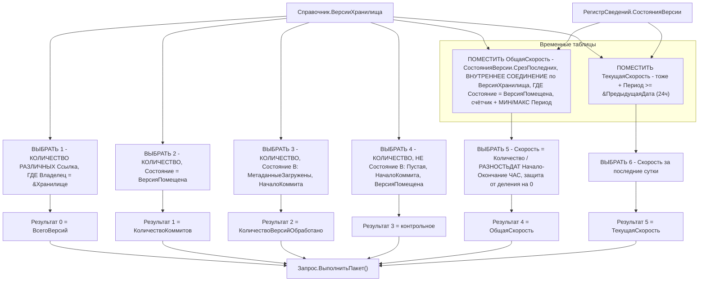
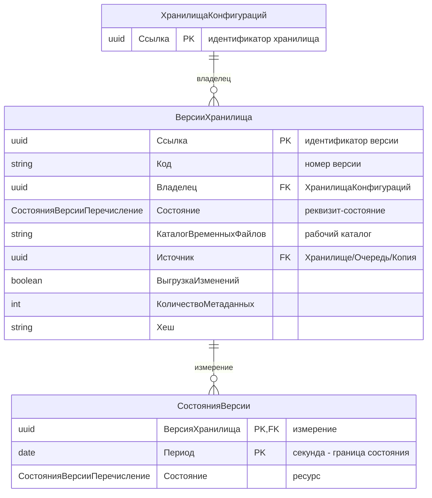

# Пакетный запрос «Сводка» формы элемента ХранилищаКонфигураций

Диаграммы построения пакетного запроса из `Catalogs/ХранилищаКонфигураций/Forms/ФормаЭлемента/Ext/Form/Module.bsl:320-412`.

## 1. Диаграмма построения запроса (поток пакета)

## 2. Диаграмма сущность-связь (ER)

## 3. Что связывает запрос с этими сущностями

- Запрос обращается к `Справочник.ВерсииХранилища` (4 счётчика) и к `РегистрСведений.СостоянияВерсии.СрезПоследних` (2 скорости).
- В `СрезПоследних` попадают записи регистра на дату среза (периодичность — секунда), поэтому для каждого момента известно актуальное состояние версии.
- Условие `&ПредыдущаяДата = ТекущаяДатаСеанса() - 86400` ограничивает период «ТекущаяСкорость» последними сутками.
- Защита от деления на ноль: если между началом и окончанием 0 часов (`РАЗНОСТЬДАТ(..., ЧАС) = 0`) — скорость принимается 0.