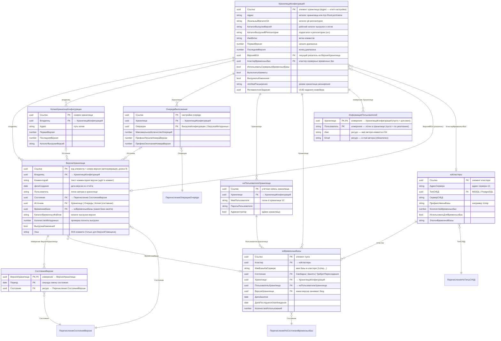

# ГитКонвертер: настройка и работа (руководство)

> **Составлено:** 28.09.2026. **Область:** конфигурация `1С:ГитКонвертер` (в исходниках — `ГитКонвертер`,
> версия **1.0.5.8**, вендор «Фирма "1С"») + внешний движок **gitsync**.
> **Источники:** `cfg_src/gitConverter` (XML-выгрузка), рабочая база `localhost\GitConv`,
> документы [BLOCKSCHEME.md](BLOCKSCHEME.md), [СОСТОЯНИЯ_ВЕРСИЙ.md](СОСТОЯНИЯ_ВЕРСИЙ.md),
> [ПОДДЕРЖКА_РАСШИРЕНИЙ.md](ПОДДЕРЖКА_РАСШИРЕНИЙ.md), [memory.md](memory.md),
> [КОНТЕКСТ_СЕССИИ.md](КОНТЕКСТ_СЕССИИ.md).
> **Назначение:** полное описание «как поставить, настроить и эксплуатировать» ГитКонвертер —
> от создания базы до разбора типовых сбоев. Технические детали алгоритма (координаты кода, пакетные
> скрипты конфигуратора) — в `BLOCKSCHEME.md`; здесь — пользовательская/административная часть.

---

## 1. Что делает ГитКонвертер

Конвертирует **историю хранилища конфигурации 1С** в **Git-репозиторий**: каждая версия хранилища
становится отдельным коммитом с автором/датой/комментарием из хранилища, а рабочее дерево — выгрузкой
конфигурации в файлы (`DumpConfigToFiles`, опционально формат 1C:EDT).

Схема одного шага:

```
Хранилище 1С ──(ConfigurationRepositoryReport)──> справочник ВерсииХранилища (диапазон версий)
            ──(ConfigurationRepositoryUpdateCfg во временную базу)──> временная база (пул)
            ──(DumpConfigToFiles)──> каталог выгрузки версии
            ──(git add / git commit)──> git-репозиторий (по коммиту на версию)
```

Есть **два способа** выполнения одной и той же задачи (см. §7):

| Способ | Кто делает работу | Когда применять |
|---|---|---|
| **Штатный конвейер 1С** | сама конфигурация ГитКонвертер (пакетные вызовы `1cv8.exe` + `git`) | основной режим; тонкий контроль, состояния версий в базе |
| **gitsync (гибрид)** | внешний движок gitsync под управлением 1С (`gitsync.bat`) | массовая первичная конвертация, когда важна скорость/многопоточность |

---

## 2. Состав решения

| Часть | Что это | Где |
|---|---|---|
| Конфигурация `ГитКонвертер` | «мозг»: справочники версий/хранилищ/временных баз, состояния, пакетные операции | база `localhost\GitConv` (файловая/серверная ИБ) |
| Пул временных баз | временные ИБ, в которых «проигрываются» версии хранилища | PostgreSQL/MSSQL-кластер + справочник `ноВременныеБазы` |
| Git | хранилище результата | `ХранилищаКонфигураций.ЛокальныйКаталогGit` (+ `АдресРепозиторияGit` для push) |
| gitsync | OneScript-скрипт `gitsync.bat` + плагины | `C:\tools\OneScript-1.9.4\bin\gitsync.bat` (пример рабочего стенда) |

Объекты метаданных конфигурации (полный перечень — Приложение А):

- **справочники:** `ХранилищаКонфигураций`, `ВерсииХранилища`, `ноКластеры`, `ноВременныеБазы`,
  `ноПользователиХранилища`, `ОчередиВыполнения`, `КопииХранилищКонфигурации`;
- **регистры сведений:** `ИнформацияПользователей` (автор коммита), `СостоянияВерсии` (журнал переходов);
- **перечисления:** `СостоянияВерсии`, `ноСостоянияВременныхБаз`, `ноТипыСУБД`, `ОперацииОчереди`;
- **константы:** 8 (см. §5.1), **функциональная опция** `ИспользоватьОчередиВыполнения`;
- **регламентные задания:** 4 (см. §5.5), **общие модули:** `КонвертацияХранилища` (ядро, 5400+ строк),
  `ОбработкаОчередей`, `ноСозданиеБазы`, `ДлительныеОперации`, служебные;
- **отчёты** `СкоростьКонвертации` (количество помещённых версий по периодам) и
  `ctmСкоростьЭтаповКонвертации` (время по этапам: среднее/медиана/мин/макс, среднее по версиям);
  **обработки** `КонвертацияВФорматEDT`, `РегламентныеИФоновыеЗадания`;
- **роли:** `ПолныеПрава`, `АдминистраторСистемы`, `ИнтерактивноеОткрытиеВнешнихОтчетовИОбработок`.

### 2.1. Диаграмма «сущность — связь» (ER)

Связи построены по ссылочным реквизитам, измерениям регистров и владению (`data_links` конфигурации;
полный состав реквизитов — §5 и Приложение А).



**Расшифровка сущностей:**

| Сущность | Роль в схеме | Ключевые связи |
|---|---|---|
| `ХранилищаКонфигураций` | корневая настройка: одно хранилище 1С = один набор путей, диапазон версий, режим | владелец для версий и копий; ссылается на указатель `ВерсияВGit` и `КластерВременныхБаз` |
| `ВерсииХранилища` | по одной записи на версию хранилища; несёт состояние конвейера, хеш и каталог выгрузки | подчинён хранилищу (`Владелец`); `Источник` — составная ссылка (хранилище / очередь / копия) |
| `СостоянияВерсии` (регистр) | журнал смен состояний (периодичность — секунда) для аналитики и сводки | измерение `ВерсияХранилища`, ресурс `Состояние` |
| `ИнформацияПользователей` (регистр) | сопоставление логина хранилища автору git-коммита | измерение `Хранилище`; пустые значения — фолбэки |
| `ноВременныеБазы` | пул временных баз: кто занят, чем и когда | ссылки на кластер, хранилище, пользователя хранилища, версию |
| `ноКластеры` | параметры сервера 1С и СУБД для создания временных баз | тип СУБД, префикс имени, число баз |
| `ноПользователиХранилища` | учётные записи хранилища (по одной на поток) | привязка к хранилищу; используются базами пула |
| `ОчередиВыполнения` | настройка режима очередей (операции выгрузки/загрузки) | хранилище + операция очереди |
| `КопииХранилищКонфигурации` | снимок хранилища для выгрузки «в стороне» | подчинён хранилищу; может быть источником версии |

**Перечисления (значения):** `СостоянияВерсии` — 8 значений жизненного цикла (§8.1);
`ноСостоянияВременныхБаз` — `Свободна`, `Занята`, `ТребуетПересоздания`;
`ноТипыСУБД` — `MSSQL`, `PostgreSQL`; `ОперацииОчереди` — `ВыгрузкаКонфигурации`, `ЗагрузкаМетаданных`.

**Важные следствия для запросов и настройки:**

- `ВерсииХранилища` и `КопииХранилищКонфигурации` — **подчинённые** справочники: выборка версий всегда
  идёт через владельца (`ГДЕ Владелец = &Хранилище`), отсюда и кнопки формы работают в контексте элемента;
- реквизит `ВерсииХранилища.Источник` — **составная** ссылка: версия может принадлежать хранилищу,
  очереди выполнения или копии хранилища; по нему конвейер определяет, кто инициировал версию;
- `ХранилищаКонфигураций.РегламентноеЗадание` — это UUID системного регламентного задания (не ссылка на
  объект метаданных), поэтому в ER отдельной сущности у него нет;
- функциональная опция `ИспользоватьОчередиВыполнения` включает объекты очередей
  (`ОчередиВыполнения`, реквизиты `ОбрабатыватьВсеОчереди`, `ЗапретитьИспользованиеОбщихОчередей`,
  `ВерсииХранилища.ВыгрузкаИзменений`) — если опция выключена, эти поля в интерфейсе недоступны.

**Кто меняет эти сущности (сервисный слой):**

| Задание | Метод | Что пишет |
|---|---|---|
| `КонвертацияХранилища` | `КонвертацияХранилища.ВыполнитьКонвертацию` | `ВерсииХранилища` (состояния, хеш, каталог), регистр `СостоянияВерсии`, `ноВременныеБазы` |
| `ОбработкаОчереди` | `ОбработкаОчередей.ОбработатьОчередь` | состояния версий по операциям очереди |
| `ВыгрузкаВерсииИзКопииХранилища` | `КонвертацияХранилища.ВыгрузитьВерсиюИзКопииХранилища` | версии копий хранилищ и их состояния |

---

## 3. Требования к окружению

| Компонент | Требование | Комментарий |
|---|---|---|
| Платформа 1С | 8.3.12 и выше (проект проверен на **8.3.27.2214**) | режим совместимости конфигурации — `Version8_3_12`, интерфейс `Taxi`, модальность запрещена |
| Сервер 1С | желателен клиент-серверный вариант | фоновые задания полноценно работают только в клиент-серверном режиме ИБ; в файловой ИБ конвейер «живёт», но параллелизм ограничен |
| СУБД | PostgreSQL или MSSQL | нужна только для **серверных** временных баз (справочник `ноКластеры`, реквизит `ТипСУБД`) |
| Git | любой актуальный (в PATH сервера 1С) | `git init`, `add`, `commit`, `rev-parse` вызываются пакетно из 1С |
| OneScript + gitsync | OneScript **1.9.4** + пакет `gitsync` (`gitsync.bat`), плагины | только для режима gitsync |
| Файловое хранилище 1С | доступ по пути (или `tcp://…`) и учётные записи с правами | пользователь хранилища нужен для каждой параллельной операции |
| Диск | каталоги выгрузки/репозитория на быстром диске | выгрузка версии — самый тяжёлый этап (6–7 мин в среднем, до 16 ч на больших версиях) |

Минимальный чек-лист «всё на месте»: `1cv8.exe` доступен серверу, `git --version` работает под той же
учётной записью, куда пишет сервер 1С, каталоги `КаталогВыгрузкиВерсий` и `ЛокальныйКаталогGit` существуют
и доступны на запись.

> Организация окружения **gitsync** (установка OneScript и пакета gitsync, плагины, переменные окружения,
> права и системные настройки, проверка установки) — отдельный раздел **§7.6**.

---

## 4. Установка конфигурации

1. **Создать информационную базу** (файловую или серверную) — это будет база ГитКонвертера
   (в проекте это `localhost\GitConv`, пользователь `Администратор`).
2. **Загрузить конфигурацию**: из `.cf`-дампа (`/LoadCfg "…\ГитКонверер1Cv8.cf" /UpdateDBCfg`) или из
   XML-исходников (`/LoadConfigFromFiles "<cfg_src\gitConverter>" /UpdateDBCfg`). Ведение разработки в этой
   базе возможно, редактирование на поддержке не используется.
3. **Проверить пользователей ИБ и роли**: администратору нужна роль `ПолныеПрава` или `АдминистраторСистемы`;
   конвейеру — права на чтение/запись справочников, регистров, выполнение регламентных и фоновых заданий.
4. **Включить состав «Все функции»** (для доступа к справочникам/регистрам без форм — например,
   `ИнформацияПользователей` форм не имеет).
5. **Проверить доступность внешних процессов** под учётной записью сервера 1С: `1cv8.exe`, `git`, при
   необходимости `gitsync.bat`.
6. **Разрешить выполнение внешних процессов**: конвейер вызывает `1cv8.exe`/`cmd`/`bash` из серверного кода
   (`ЗапуститьПриложение`), поэтому сервер должен иметь право запускать приложения.

> После загрузки конфигурации в базе появляются 4 регламентных задания (все выключены — включаются по мере
> настройки, §6.6).

---

## 5. Объектная модель: что где настраивается

> Карта связей объектов (ER-диаграмма) — в §2.1. Ниже — назначение каждого объекта и его реквизитов.

### 5.1. Константы (глобальные настройки сервера)

| Константа | Тип | Назначение |
|---|---|---|
| `ПутьКВерсиямПлатформыНаСервере` | Строка | каталог, где лежат версии платформы (`C:\Program Files\1cv8`); из него выбирается нужная версия `1cv8.exe` |
| `ИспользоватьОчередиВыполнения` | Булево | включает режим очередей (функциональная опция `ИспользоватьОчередиВыполнения`) |

> **⚠️ Изменение от 28.09.2026 (вариант B — «только движок»).** Режим gitsync **удалён из конфигурации**:
> константы `ctmПутьКОнеСкриптНаСервере` / `ctmПутьКПлагинамGitsync` / `ctmБазаGitsyncНаСервере`, регламентное
> задание `ctmКонвертацияХранилищаGitsync`, реквизит `ctmИспользоватьGitsync` и весь gitsync-код общего модуля
> `КонвертацияХранилища` — **отсутствуют** (в таблице выше было 5 строк, осталось 2). Легаси-имена
> `БазаGitsyncНаСервере`, `ИмяБазыGitsyncНаСервере`, `ПутьКОнеСкриптНаСервере` удалены вместе с ними.
> Внешние инструменты на стенде (OneScript, плагины gitsync, каталоги git, `gitsync-multithread`,
> `qwery`) **сохранены**. Разделы §7.5 и §7.6 оставлены как историческая справка (помечены).
> Итоги и обоснование — [ВЕРИФИКАЦИЯ_БАЗЫ_GITCONV.md](ВЕРИФИКАЦИЯ_БАЗЫ_GITCONV.md).

### 5.2. Справочник `ноКластеры` — параметры серверных временных баз

| Реквизит | Смысл |
|---|---|
| `АдресСервера` | адрес сервера 1С кластера (например `localhost`) |
| `ТипСУБД` | `MSSQL` / `PostgreSQL` (`Перечисление.ноТипыСУБД`) |
| `СерверСУБД`, `ИмяПользователяСУБД`, `ПарольПользователяСУБД` | доступ к СУБД для `CREATEINFOBASE` |
| `ИмяПользователяКластера`, `ПарольПользователяКластера` | администратор кластера (если требуется) |
| `ПрефиксИмениБазы` | префикс имён создаваемых баз (например `1ctmp`) |
| `КоличествоВременныхБаз` | сколько баз создавать в кластере |
| `ИспользоватьДляВременныхБаз` | кластер участвует в пуле временных баз |
| `ЭталонВременнойБазы` | имя базы-эталона (для создания «по образцу») |
| `Комментарий` | произвольная заметка |

### 5.3. Справочник `ноВременныеБазы` — пул временных баз

| Реквизит | Смысл |
|---|---|
| `Кластер` | ссылка на `ноКластеры`; обязателен |
| `ИмяБазыНаСервере` | полное имя базы в кластере (напр. `1ctmp_vremennaya`) |
| `Состояние` | `Свободна` / `Занята` / `ТребуетПересоздания` (`Перечисление.ноСостоянияВременныхБаз`) |
| `Хранилище` | к какому хранилищу приписана база |
| `ПользовательХранилища` | элемент `ноПользователиХранилища` (под кем база работает с хранилищем) |
| `ИмяПользователяХранилища`, `ПарольПользователяХранилища` | учётные данные (текстом) |
| `ВерсияХранилища`, `ДатаЗанятия`, `ДатаПоследнегоОсвобождения`, `КоличествоИспользований` | служебные: какая версия занимала базу, когда, сколько раз |

Кнопки формы элемента: **«Создать базу»** (пакетный `CREATEINFOBASE` по параметрам кластера) и
**«Сделать пользователя хранилища»** (создаёт/обновляет элемент `ноПользователиХранилища` для этой базы).

Правила пула:

- конвейер сам берёт свободную базу (`ноВременныеБазы.НайтиСвободную(Кластер, Хранилище)`), помечает
  `Занята`, а по завершении — `Свободна`;
- `МаксимальноеКоличествоПодготавливаемыхВерсий` (реквизит хранилища) **не может превышать** число баз пула;
- серверные базы перед работой **обнуляются**: отвязка от хранилища (`ConfigurationRepositoryUnbindCfg -force`)
  + загрузка пустой конфигурации из общего макета `ctmПустаяКонфигурация` (`ctmРазвернутьПустуюКонфигурацию`
  → `ctmОбнулитьВременнуюБазу`);
- состояние `ТребуетПересоздания` означает, что базу нужно обнулить/пересоздать (кнопка «Создать базу» или
  «Освободить временные базы» на форме хранилища).

### 5.4. Справочник `ноПользователиХранилища` — учётные записи хранилища

Реквизиты: `Хранилище`, `ИмяПользователя` (логин **в хранилище 1С**), `ПарольПользователя`,
`Администратор` (флаг «админ хранилища»). Форм нет — записи вводятся набором записей либо создаются кнопкой
«Сделать пользователя хранилища» из формы временной базы. Смысл: дать каждой параллельной операции
**своего** пользователя хранилища (несколько одновременных сеансов одного логина блокируют друг друга).

### 5.5. Регламентные задания

| Задание | Метод | Роль |
|---|---|---|
| `КонвертацияХранилища` | `ОбщийМодуль.КонвертацияХранилища.ВыполнитьКонвертацию` | штатный оркестратор: получить версии → выгрузить → закоммитить |
| `ОбработкаОчереди` | `ОбщийМодуль.ОбработкаОчередей.ОбработатьОчередь` | режим очередей (операции «ВыгрузкаКонфигурации»/«ЗагрузкаМетаданных») |
| `ВыгрузкаВерсииИзКопииХранилища` | `КонвертацияХранилища.ВыгрузитьВерсиюИзКопииХранилища` | выгрузка версии из «копии хранилища» (резервный сценарий) |

> Задание `ctmКонвертацияХранилищаGitsync` из этой таблицы **удалено 28.09.2026** вместе с режимом gitsync
> (§5.1, §7.5) — в конфигурации осталось три регламентных задания.

Расписание задаётся **на форме элемента хранилища**: реквизит `РегламентноеЗадание` (UUID задания) +
поле «Расписание» с кнопкой редактора расписания. Для конвейера типично расписание «каждую минуту»
(на рабочем стенде фактический цикл — ~5 минут).

### 5.6. Прочие объекты

- `ОчередиВыполнения` — настройки режима очередей: `Хранилище`, `Операция`, `МаксимальноеКоличествоОпераций`,
  `РегламентноеЗадание`, `ПрефиксНачалаНомераВерсии`, `ПрефиксОкончанияНомераВерсии`.
- `КопииХранилищКонфигурации` — «копия хранилища» (снимок) для выгрузки версий без нагрузки на рабочее
  хранилище: `Адрес`, `ПерваяВерсия`, `ПоследняяВерсия`, `КаталогВыгрузкиВерсий`, учётные данные,
  `РегламентноеЗадание`.
- `РегистрСведений.СостоянияВерсии` — история смен состояний (измерение `ВерсияХранилища`, ресурс
  `Состояние`, периодичность — секунда). Основа аналитики (см. [АНАЛИТИКА_ЭТАПОВ.md](АНАЛИТИКА_ЭТАПОВ.md)).
- `РегистрСведений.ИнформацияПользователей` — соответствие логина хранилища автору git-коммита (§6.4).

---

## 6. Пошаговая настройка хранилища

> Порядок шагов обязателен: конвейер читает настройки с самого начала работы, и «пустые» реквизиты дают
> либо ошибку в журнале регистрации, либо молчаливое отсутствие коммитов.

### 6.1. Шаг 0. Константы сервера

Заполнить `ПутьКВерсиямПлатформыНаСервере` — каталог с версиями платформы (`1cv8.exe`); при необходимости
`ИспользоватьОчередиВыполнения` (режим очередей).

> Ранее на этом шаге заполнялись константы gitsync (`ctmПутьКОнеСкриптНаСервере`, `ctmПутьКПлагинамGitsync`,
> `ctmБазаGitsyncНаСервере`) — вместе с режимом gitsync они **удалены из конфигурации 28.09.2026** (§5.1, §7.5).

### 6.2. Шаг 1. Кластеры и временные базы (серверный режим)

1. Завести элемент `ноКластеры`: адрес сервера 1С, тип СУБД, доступ к СУБД, префикс имени базы,
   количество баз.
2. Кнопкой **«Создать базу»** на форме элемента `ноВременныеБазы` создать нужное число баз (или создать
   базы вручную через `CREATEINFOBASE` и заполнить справочник).
3. Для каждой базы заполнить `Хранилище`, `ПользовательХранилища`, `ИмяПользователяХранилища`,
   `ПарольПользователяХранилища`. Проще всего — кнопка **«Сделать пользователя хранилища»**.
4. Обнулить базы пустой конфигурацией: `ConfigurationRepositoryUnbindCfg -force` +
   `LoadCfg "<пустая>.cf" /UpdateDBCfg` (пустая конфигурация разворачивается из макета `ctmПустаяКонфигурация`
   функцией `ctmРазвернутьПустуюКонфигурацию`).

Число баз пула определяет параллелизм: `МаксимальноеКоличествоПодготавливаемыхВерсий` ≤ число баз.
Для файлового режима (`ИспользоватьСерверныеВременныеБазы = Ложь`) база создаётся на каждый шаг
(`СоздатьФайловуюИнформационнуюБазу`) — пул не нужен, но скорость ниже.

### 6.3. Шаг 2. Пользователи хранилища и авторы коммитов — **самое первое по важности**

Хранилище 1С знает своих пользователей по логину, а Git требует имя и e-mail. Поэтому:

1. `ноПользователиХранилища` — завести учётные записи хранилища (по одной на параллельный поток;
   плюс «админ хранилища» с флагом `Администратор`).
2. `РегистрСведений.ИнформацияПользователей` — для **каждого** логина из истории версий указать пару
   `Имя` + `Email` (ресурсы обязательны). Форм у регистра нет: «Все функции» → Регистры сведений →
   Информация пользователей (или кнопка «Получить все версии и заполнить пользователей» — она
   предзаполняет записи по полю `Пользователь` версий, см. §8.2).
3. Поддерживаются фолбэки: запись с пустым `Хранилище` — общая для всех хранилищ; с пустым `Пользователем` —
   значение по умолчанию.

Что будет, если не заполнить:

- логин останется логином хранилища, e-mail станет `anonimous@localhost`;
- если у хранилища выключен флаг `РазрешитьПомещатьАнонимноЕслиНеНайденПользователь` — **коммиты не
  выполняются вовсе**, молча (ни ошибки, ни записи в ЖР).

Значения уходят в коммит как `GIT_AUTHOR_NAME`/`GIT_AUTHOR_EMAIL` и `GIT_COMMITTER_*`.

### 6.4. Шаг 3. Реквизиты элемента `ХранилищаКонфигураций`

Все 33 реквизита по группам:

**Пути и адреса**

| Реквизит | Смысл | Пример стенда |
|---|---|---|
| `Адрес` (обяз.) | адрес хранилища: каталог или `tcp://host:port/name` | `E:\rep\task` |
| `ЛокальныйКаталогGit` (обяз.) | каталог локального git-репозитория | `E:\rep\task_git_file210` |
| `КаталогВыгрузкиВерсий` (обяз.) | рабочий каталог выгрузок и служебных файлов | `E:\rep\task_temp_file210` |
| `КаталогВыгрузкиВРепозитории` (обяз.) | подкаталог репозитория, куда кладётся выгрузка (`src`) | `src` |
| `ИмяВетки` (обяз.) | ветка, в которую идут коммиты | `master` |
| `ВерсияПлатформы` | версия платформы для пакетных операций (пусто — последняя из `ПутьКВерсиямПлатформыНаСервере`) | `8.3.27.2214` |
| `АдресРепозиторияGit`, `ПользовательСервераGit`, `ПарольСервераGit` | remote для push и учётные данные к нему | — |
| `Описание` | произвольная заметка | — |

**Учётные данные и идентификация**

| Реквизит | Смысл |
|---|---|
| `ИмяПользователяХранилища` (обяз.) | логин **администратора** хранилища (для отчётов и служебных операций) |
| `ПарольПользователяХранилища` | его пароль |

**Диапазон версий**

| Реквизит | Смысл |
|---|---|
| `ПерваяВерсия` | с какой версии начинать (0 — с первой доступной) |
| `ПоследняяВерсия` | по какую версию конвертировать |
| `ВерсияВGit` | указатель «докуда закоммичено» (ссылка на `ВерсииХранилища`) |

**Режимы работы**

| Реквизит | Смысл |
|---|---|
| `ВыполнятьКоммиты` | выполнять ли git-коммиты (иначе — только подготовка выгрузок) |
| `ВыгружатьИзменения` | выгружать только изменения (`-getChanges`), а не полную конфигурацию |
| `ИспользоватьСерверныеВременныеБазы` | `Истина` — работать через пул серверных баз; `Ложь` — файловые временные базы |
| `КластерВременныхБаз` | кластер, из которого берутся базы (для серверного режима) |
| `КонвертироватьВФорматEDT` | после выгрузки импортировать версию в формат 1C:EDT (`ring edt workspace import`) |
| `УдалятьКонфигурацииПоставщиков` | удалять из выгрузки файлы на поддержке поставщика |
| `ОбрабатыватьВсеОчереди`, `ЗапретитьИспользованиеОбщихОчередей` | поведение в режиме очередей (общие очереди и чужие хранилища) |

**Производительность и порядок**

| Реквизит | Смысл |
|---|---|
| `МаксимальноеКоличествоПодготавливаемыхВерсий` | сколько версий держать «в подготовке» одновременно (≤ числа баз пула) |
| `КоличествоКоммитов` | ограничение числа коммитов за прогон (0 — без ограничения) |
| `МинимальноеКоличествоМетаданных` | порог «пустой» выгрузки: меньше — версия сбрасывается в «ПустаяСсылка» |
| `УдалятьВременныеДанныеВерсииПослеКоммита` | чистить каталог выгрузки версии после коммита |
| `ОстановитьКонвертацию` | «стоп-кран»: при `Истина` задания конвертации не выполняются |
| `РазрешитьПомещатьАнонимноЕслиНеНайденПользователь` | разрешать коммит от `anonimous@localhost`, если логина нет в регистре |
| `РегламентноеЗадание` | UUID регламентного задания конвейера (задаётся формой) |

**Расширения и gitsync**

| Реквизит | Смысл |
|---|---|
| `ctmИмяРасширения` | имя хранилища **расширения** конфигурации; заполнено → конвейер работает в режиме расширения |
| `ctmКаталогЗасеваРасширения` | каталог XML-выгрузки расширения для засева временной базы |

Форма проверяет обязательность (`ОбработкаПроверкиЗаполненияНаСервере`): без `Адрес`, `КаталогВыгрузкиВерсий`,
`ЛокальныйКаталогGit`, `ИмяВетки`, `КаталогВыгрузкиВРепозитории`, `ИмяПользователяХранилища` запись не пройдёт.

### 6.5. Шаг 4. Создание git-репозитория

Кнопка **«Создать репозиторий git»** (подсказка: «Создать репозиторий Git и установить начальные настройки»):

- выполняет `git init` в `ЛокальныйКаталогGit`;
- задаёт локальные настройки (в т.ч. `core.quotepath`, `core.autocrlf`, `diff.renames`);
- создаёт `.gitignore` и `.gitattributes`;
- при необходимости — начальный коммит/проверку.

Дополнительно:

- **«Установить адрес репозитория git»** — прописывает `remote origin` из `АдресРепозиторияGit`
  (если используется push в общий репозиторий);
- ветка коммитов берётся из `ИмяВетки`; при повторном прогоне в тот же каталог история дописывается;
- ⚠️ на Windows-сервере репозиторий, созданный другим пользователем ОС, Git считает «чужим»
  (`dubious ownership`) — лечится настройкой `safe.directory` (см. [КОНТЕКСТ_СЕССИИ.md](КОНТЕКСТ_СЕССИИ.md) §19).

### 6.6. Шаг 5. Диапазон версий и запуск

1. Заполнить `ПерваяВерсия` / `ПоследняяВерсия`.
2. Кнопкой **«Получить все версии и заполнить пользователей»** (или **«Загрузить версии из отчета по
   хранилищу»**) сформировать отчёт по хранилищу и заполнить `Справочник.ВерсииХранилища` и регистр
   `ИнформацияПользователей`.
3. Нажать **«Запустить конвертацию»** — запустится фоновое задание `ВыполнитьКонвертацию`
   (либо включить регламентное задание `КонвертацияХранилища` с расписанием).
4. Контроль: кнопка **«Обновить состояние»** (или переключатель «Обновлять состояние автоматически
   (каждые 20 сек)») на форме хранилища + Журнал регистрации (Правила 2 и 5 проекта).

> ⚠️ **Перед повторным прогоном диапазона обязательно очищать `КаталогВыгрузкиВерсий`**: конвейер
> переиспользует уже существующие `git_command_N.bat` / `git_comment_N.txt` и коммиты уйдут со старым
> текстом сообщения (в проекте это уже приводило к трём одинаковым коммитам версии 861).

---

## 7. Режимы работы конвейера

### 7.1. Файловый режим

`ИспользоватьСерверныеВременныеБазы = Ложь`. Под каждую версию создаётся своя файловая ИБ
(`CREATEINFOBASE File="…"`), в неё загружается конфигурация версии, выгружается в XML, затем база удаляется.
Плюс: не нужна СУБД/кластер. Минус: медленнее, меньше параллелизма.

### 7.2. Серверный режим (пул временных баз) — рекомендуемый

`ИспользоватьСерверныеВременныеБазы = Истина`, `КластерВременныхБаз` заполнен. Базы уже существуют
в кластере, конвейер берёт свободную, обновляет её до нужной версии хранилища
(`ConfigurationRepositoryUpdateCfg -force -v N`) и освобождает. Параллелизм = число баз в пуле.
Требуется сервер 1С + СУБД, и каждая база работает **под своим** пользователем хранилища.

### 7.3. Режим очередей

Функциональная опция `ИспользоватьОчередиВыполнения` + справочник `ОчередиВыполнения`. Тяжёлые этапы
выносятся в очереди по операциям: «ВыгрузкаКонфигурации» (`ВерсияПолучена` → `ВерсияВыгружена`) и
«ЗагрузкаМетаданных» (`ВерсияВыгружена` → `МетаданныеЗагружены`). Разбирает очереди регламентное задание
`ОбработкаОчереди`. Смысл — распределить нагрузку и не занимать пул баз на время длинных выгрузок.

> **Когда очередь обязательна.** Если ФО `ИспользоватьОчередиВыполнения = Истина`, то этапы «выгрузка»
> и «загрузка метаданных» запускаются **только** очередями (`ЗапуститьОбработкуВерсииВФоне` при
> включённой ФО сразу делает `Возврат`). Поэтому для **каждого** хранилища, прогоняемого при включённой
> ФО, должны существовать обе очереди, включены их регламентные задания, а у хранилища —
> `ОбрабатыватьВсеОчереди = Истина`. Иначе версии «зависают» в состоянии `ВерсияПолучена` без ошибок в ЖР
> (см. разбор ниже).

#### 7.3.1. Инструкция: настройка очередей для хранилища (пример `E:\rep\erp25ExtDopFunkcional`)

**Симптом отсутствия очередей.** Версии переходят в `Версия получена` и стоят; активных фоновых заданий
нет; Журнал регистрации пуст; в `КаталогВыгрузкиВерсий` появляются каталоги версий, но `dump`/`params_*_2.txt`
не создаются. Причина: этап выгрузки некому запустить.

**Порядок настройки (всё — в базе `localhost\GitConv`):**

1. **Проверить ФО и список очередей.**
   - `ПолучитьФункциональнуюОпцию("ИспользоватьОчередиВыполнения")` → обычно `Истина`.
   - Справочник `ОчередиВыполнения`: найти записи с `Хранилище = <нужное хранилище>`.
     Для полного режима нужны **две**: `Операция = ВыгрузкаКонфигурации` и `Операция = ЗагрузкаМетаданных`.

2. **Создать недостающие очереди** (по одной на операцию). Наименование — произвольное, удобно
   `<Адрес хранилища> - <операция>`, `МаксимальноеКоличествоОпераций` — например `10`:

   ```bsl
   Хр = Справочники.ХранилищаКонфигураций.НайтиПоНаименованию("E:\rep\erp25ExtDopFunkcional", Истина);

   Об = Справочники.ОчередиВыполнения.СоздатьЭлемент();
   Об.Наименование = "E:\rep\erp25ExtDopFunkcional - Выгрузка конфигурации";
   Об.Хранилище = Хр;
   Об.Операция = Перечисления.ОперацииОчереди.ВыгрузкаКонфигурации;
   Об.МаксимальноеКоличествоОпераций = 10;
   Об.Записать();   // регламентное задание создаётся автоматически модулем объекта очереди

   Об = Справочники.ОчередиВыполнения.СоздатьЭлемент();
   Об.Наименование = "E:\rep\erp25ExtDopFunkcional - Загрузка метаданных";
   Об.Хранилище = Хр;
   Об.Операция = Перечисления.ОперацииОчереди.ЗагрузкаМетаданных;
   Об.МаксимальноеКоличествоОпераций = 10;
   Об.Записать();
   ```

   > При записи элемента очереди её регламентное задание `ОбработкаОчереди` создаётся автоматически
   > (имя, ключ и параметры проставляет модуль объекта), но создаётся **выключенным**.

3. **Включить у хранилища приём очередей.** `ОбрабатыватьВсеОчереди = Истина`
   (иначе запрос очереди, содержащий `И ХранилищаКонфигураций.ОбрабатыватьВсеОчереди`, не вернёт ни одной
   версии). `ЗапретитьИспользованиеОбщихОчередей = Ложь`, если допускается брать версии из общих очередей.

   ```bsl
   Об = Хр.ПолучитьОбъект();
   Об.ОбрабатыватьВсеОчереди = Истина;
   Об.Записать();
   ```

4. **Включить регламентные задания очередей.** У найденных в справочнике очередей есть реквизит
   `РегламентноеЗадание` (УникальныйИдентификатор). Включить через дополнительные свойства элемента
   (тем же приёмом, что и задание конвертации) либо штатной формой:

   ```bsl
   Расписание = Новый РасписаниеРегламентногоЗадания;
   Расписание.ПериодПовтораВТечениеДня = 60;   // раз в минуту

   Об = Очередь.ПолучитьОбъект();
   Об.ДополнительныеСвойства.Вставить("Использование", Истина);
   Об.ДополнительныеСвойства.Вставить("Расписание", Расписание);
   Об.Записать();
   ```

5. **Включить задание конвертации хранилища** (`КонвертацияХранилища`, реквизит `РегламентноеЗадание`
   элемента хранилища) — оно создаёт версии, очереди их разбирают.

**Итоговая цепочка:** `КонвертацияХранилища` → получение версии (`ВерсияПолучена`) → очередь «Выгрузка
конфигурации» → `ВерсияВыгружена` → очередь «Загрузка метаданных» → `МетаданныеЗагружены` → `ВыполнитьКоммиты`
→ `ВерсияПомещена`.

#### 7.3.2. Частые грабли очередей (из практики прогона 3729–3778)

| Симптом | Причина | Что делать |
|---|---|---|
| Версии стоят в `ВерсияПолучена`, фоновых нет, ЖР пуст | Для хранилища нет очередей (ФО включена — прямой запуск этапов заблокирован) | Создать обе очереди (п. 2) |
| Очереди есть, но ни одна версия не берётся | У хранилища `ОбрабатыватьВсеОчереди = Ложь` | Включить `Истина` (п. 3) |
| Задания очередей есть, но `Исп=Нет` | Задание очереди создаётся выключенным | Включить (п. 4) |
| Первый коммит падает: «Формирование файла невозможно для версии со статусом "Начало коммита"» | `ВерсияВGit` указывает на версию с пустым состоянием (не конвертировалась) | Очистить `ВерсияВGit` (или выставить на реально помещённую), затем восстановить указатель по факту коммитов |
| Параллельные запуски: «Задание с таким ключом уже выполняется», «Ошибка совместного доступа к …`1Cv8.1CD`» | Ручной запуск одновременно с регламентным | Не запускать вручную при активном задании |

**Проверенный пример (29.09.2026).** Хранилище расширения `E:\rep\erp25ExtDopFunkcional`, диапазон
`3729..3778` (50 версий), новый каталог Git `E:\rep\erp25ExtDopFunkcional_git50`. После создания двух
очередей, включения их заданий и `ОбрабатыватьВсеОчереди = Истина` прогон прошёл 50 коммитов за ~50 минут
(≈1 мин/версия), ЖР без ошибок, временные каталоги удалены (`УдалятьВременныеДанныеВерсииПослеКоммита = Истина`).

### 7.4. Режим хранилища расширения конфигурации

Заполнен `ctmИмяРасширения` (и, при необходимости, `ctmКаталогЗасеваРасширения`). Порядок:

1. расширение засевается во временную базу (`ibcmd extension create` или
   `/LoadConfigFromFiles "<каталог засева>" -AllExtensions /UpdateDBCfg`);
2. версия берётся не через `ConfigurationRepositoryUpdateCfg`, а через
   `ConfigurationRepositoryDumpCfg -v<N> -Extension "<имя>"` + `/LoadCfg`;
3. далее обычная выгрузка в XML и коммит.

Критично: ключ `-Extension "<имя>"` должен стоять **строго после** ключей хранилища
(`/ConfigurationRepositoryReport out.mxl -NBegin 1 -Extension ExtDopFunkcional`), иначе платформа
ответит «Соединение основной конфигурации с хранилищем расширений конфигураций невозможно»
(подробно — [ПОДДЕРЖКА_РАСШИРЕНИЙ.md](ПОДДЕРЖКА_РАСШИРЕНИЙ.md)).

### 7.5. Режим gitsync (гибрид)

> **⚠️ УДАЛЕНО 28.09.2026 (вариант B).** Флаг `ctmИспользоватьGitsync`, задание
> `ctmКонвертацияХранилищаGitsync` и процедуры `ctmВыполнитьСинхронизациюГитсинк*` из конфигурации удалены;
> включить режим gitsync в текущей конфигурации **невозможно**. Раздел ниже — историческая справка
> (описание до удаления) и полезен, если функционал будут возвращать. Обоснование — в
> [ВЕРИФИКАЦИЯ_БАЗЫ_GITCONV.md](ВЕРИФИКАЦИЯ_БАЗЫ_GITCONV.md).

Включается флагом `ctmИспользоватьGitsync = Истина`; работает регламентным заданием
`ctmКонвертацияХранилищаGitsync`. Обязательные условия: **серверные** временные базы (кластер),
константы `ctmПутьКОнеСкриптНаСервере`, `ctmБазаGitsyncНаСервере` (при пустом значении — ошибка
«Режим gitsync поддерживается только при использовании серверных временных баз»).

Что делает конвейер (`ctmВыполнитьСинхронизациюГитсинк`):

1. обнуляет все свободные базы пула (отвязка + пустая конфигурация);
2. формирует в `КаталогВыгрузкиВерсий` два файла: `gitsync_connections.txt` (строки `/S <сервер>\<база>`)
   и `gitsync_run.bat` (ANSI);
3. запускает команду вида:

```
"<ctmПутьКОнеСкриптНаСервере>\gitsync.bat" --v8-path "<1cv8.exe>" [--v8version "<версия>"]
  -C "/S <АдресСервера>\<база истории>" s -n <число баз>
  --connections-file "<…\gitsync_connections.txt>"
  --storage-users "<u1,u2,…>" --storage-pwds "<p1,p2,…>"
  [--minversion <N>] [--maxversion <M>]
  -u "<пользователь хранилища>" [-p "<пароль>"] "<адрес хранилища>" "<локальный каталог git>"
```

   (перед запуском в `PATH` добавляется каталог OneScript, в `GITSYNC_PLUGINS_PATH` — каталог плагинов);
4. пишет журналы `gitsync.log` и `gitsync_orchestrator.txt` в `КаталогВыгрузкиВерсий`;
5. по завершении обновляет базу по git-истории: `ВерсияВGit` и состояния версий
   (`ctmЗаписатьОбратноСостояния`).

Диапазон gitsync-прогона: от `ВерсияВGit + 1` (или `ПерваяВерсия`) до `ПоследняяВерсия`.

### 7.6. Организация окружения gitsync (установка и системные настройки)

> **⚠️ УДАЛЕНО 28.09.2026 (вариант B).** Код и объекты gitsync из конфигурации удалены; внешние инструменты
> и каталоги на стенде **оставлены как есть** (см. фактические пути в тексте ниже). Раздел сохраняется как
> справочник по установке окружения — пригодится, если режим будут возвращать.

Раздел описывает, **что и куда ставить**, чтобы режим gitsync (§7.5) заработал, и какие настройки для этого
нужны на уровне ОС/сервера. Факты сверены с рабочей установкой 28.09.2026 (проверки — в конце раздела).

**Состав компонентов и каталогов**

| Компонент | Что это | Каталог на стенде |
|---|---|---|
| **OneScript** | движок скриптов `.os` (внутри — `oscript.exe`, `opm.bat`, каталог `lib`) | `C:\tools\OneScript-1.9.4` |
| **Пакет gitsync** | собственно движок синхронизации; при установке через `opm` распаковывается в `<OneScript>\lib\gitsync` | `C:\tools\OneScript-1.9.4\lib\gitsync` (3.8.0) |
| **Обёртка `gitsync.bat`** | создаётся установщиком пакета; переключает кодировку на 65001 и вызывает `oscript <...>\lib\gitsync\src\cmd\gitsync.os %*` | `C:\tools\OneScript-1.9.4\bin\gitsync.bat` |
| **Плагины `gitsync-plugins`** | набор предустановленных плагинов + файл `plugins.json` (какие активны) | `C:\tools\gitsync_plugins` (+ внутри пакет `gitsync-plugins`) |
| **git** | вызывается самим gitsync (`git add/commit/…`) | `C:\Program Files\Git\cmd` (в системном `PATH`) |
| **Рабочие каталоги конвейера** | репозиторий, каталог выгрузки и служебных файлов | `ЛокальныйКаталогGit`, `КаталогВыгрузкиВерсий` реквизитов хранилища |
| **Серверные временные базы** | gitsync работает только через них (потоки) | кластер из справочника `ноКластеры` |

**Установка OneScript**

1. Скачать сборку OneScript версии **1.9.x** (на стенде — 1.9.4) с официального сайта/релизов OneScript.
2. Установить/распаковать в каталог **без пробелов и кириллицы** (пример стенда: `C:\tools\OneScript-1.9.4`).
3. Убедиться, что доступны `oscript.exe` и `opm.bat` (`<OneScript>\bin`), и что этот каталог попадает в `PATH`
   той учётной записи, под которой запускается gitsync (см. «Что настраивать в системе»).
4. Проверка: `oscript --version`, `opm --version`.

> **Почему важен `PATH`.** Сгенерированный установщиком `gitsync.bat` вызывает `oscript` **по имени**:
> `@call oscript "C:\tools\OneScript-1.9.4\lib\gitsync\src\cmd\gitsync.os" %*`. Если `<OneScript>\bin`
> нет в `PATH`, получите `'oscript' is not recognized as an internal or external command` (проверено
> фактически на этом стенде: `oscript`/`opm` в системный `PATH` не добавлены). Конвейер обходит это тем,
> что сам пишет `PATH` в генерируемый `gitsync_run.bat` (см. §7.5).

**Установка пакета gitsync — два варианта**

| Вариант | Как ставить | Что даёт | Ограничение |
|---|---|---|---|
| **Upstream** (обычный) | `opm install gitsync` (онлайн) либо офлайн: скачать `gitsync-<версия>.ospx` и `opm install -f <файл>` | полный CLI: `init`, `sync`, `clone`, `all`, `set-version`, `plugins` | **нет** многопоточных опций `-n`, `--connections-file`, `--storage-users`, `--storage-pwds` |
| **Форк `gitsync-multithread`** | из клона `gitsync-multithread/`: `opm build` **или** готовый `gitsync-3.6.0.ospx` → `opm install -f <файл>` | потоковую выгрузку: `-n <число потоков>`, `--connections-file <файл соединений временных баз>`, `--storage-users`, `--storage-pwds` | собирать под установленную версию OneScript (в `packagedef` указано `ВерсияСреды 1.9.0`) |

Опции **установленного** пакета 3.8.0 (получены на стенде командами `gitsync --help` и `gitsync s --help`):

- корневые: `--v8version`, `--v8-path`, `-v/--verbose`, `-U/--ib-user`, `-P/--ib-pwd`, `-C/--ib-connection`,
  `-t/--tempdir`, `--git-path`, `--domain-email`;
- `sync`: `-u/--storage-user`, `-p/--storage-pwd`, `-e/--extension`, `-d/--disable-auto-src`,
  плюс опции плагинов `-l/--limit`, `--minversion`, `--maxversion` (в справке помечены `[*limit]`);
- команды: `usage/u`, `init/i`, `sync/s`, `clone/c`, `all/a`, `set-version/sv`, `plugins/p`.

> ⚠️ **Расхождение, требующее решения (бэклог).** Конвейер (`ctmВыполнитьСинхронизациюГитсинк`, §7.5) формирует
> команду с **форковыми** опциями (`-n`, `--connections-file`, `--storage-users`, `--storage-pwds`), а на стенде
> глобально установлен **upstream 3.8.0**, где этих опций нет (проверено его справкой). Чтобы режим gitsync
> работал «как закодировано», нужно установить форк (`opm install -f gitsync-3.6.0.ospx`) либо собирать форк
> под OneScript 1.9.4; альтернатива — упростить вызов до одномпоточного варианта `gitsync s ...`
> (тогда достаточно upstream).

**Плагины (`gitsync-plugins`)**

1. Установка: `opm install gitsync-plugins`. Совместимость версий: **gitsync 3.8.0 ↔ gitsync-plugins 2.0.3**
   (именно эта пара на стенде); при обновлении gitsync сверяйтесь с таблицей соответствия в README gitsync.
2. Управление: `gitsync plugins init` — инициализация предустановленных плагинов (обязательна после обновления
   gitsync), `gitsync plugins list` / `list -a` — активные / все установленные, `gitsync plugins enable` —
   интерактивная активация. Короткий алиас команды — `p`.
3. Где лежат: по умолчанию `%USERPROFILE%\AppData\Local\gitsync\plugins` (Windows) или `$HOME/.local/share`
   (Linux); там же — файл `plugins.json` с флагами плагинов.
4. **Внешний каталог плагинов** задаётся переменной окружения **`GITSYNC_PLUGINS_PATH`** (синонимы:
   `GITSYNC_PLUGINS_DIR`, `GITSYNC_PL_DIR`). Именно так работает конвейер: подставляет в генерируемый
   `gitsync_run.bat` значение константы `ctmПутьКПлагинамGitsync` (пример стенда — `C:\tools\gitsync_plugins`).
5. Содержимое `plugins.json` (стенд) — флаги плагинов: `increment`, `limit`, `check-authors`, `check-comments`,
   `smart-tags`, `tool1CD`, `unpackForm`, `disable-support`, `sync-remote`, `edtExport`, `replace-authors`,
   `use-ibcmd`, `drop-config-dump`, `drop-support`, `roboCopy`. На стенде включён только `limit`.
6. **Следствие:** `--limit`, `--minversion`, `--maxversion` — это опции **плагина `limit`**, а не ядра gitsync:
   диапазон версий в gitsync-прогоне работает только при активном плагине (в `plugins.json` `"limit": true`).

**git и прочие зависимости**

| Что | Требование | Проверка |
|---|---|---|
| **git** | 2.x в `PATH` учётной записи, запускающей gitsync; для репозиториев, созданных под другой учёткой ОС (USR1CV8), — `git config --global --add safe.directory <путь>` | `git --version`; `git -C <каталог> status` |
| **Платформа 1С** | версия из `ПутьКВерсиямПлатформыНаСервере` / реквизита `ВерсияПлатформы`; gitsync получает путь через `--v8-path`/`GITSYNC_V8_PATH` | `<каталог>\1cv8.exe /?` |
| **`ring`** (OneScript-пакет) | нужен для работы с 1С > 8.3.11 при выгрузке в формат 1C:EDT (требование upstream) | `ring --version` |
| **`ibcmd`** | только если используется плагин `use-ibcmd` (режим расширения, §7.4) | есть в `8.3.27.2214\bin` |
| **Серверные временные базы** | кластер 1С + СУБД; в gitsync-режиме файловые базы не используются | справочники `ноКластеры` / `ноВременныеБазы` |

**Переменные окружения gitsync** (по `gitsync --help` и исходникам; опция-аналог указана рядом)

| Переменная | Что задаёт | Опция |
|---|---|---|
| `GITSYNC_V8_PATH`, `GITSYNC_V8VERSION` | путь к платформе и маска её версии (`8.3.27.2214`) | `--v8-path`, `--v8version` |
| `GITSYNC_VERBOSE` | подробный отладочный вывод | `-v` |
| `GITSYNC_IB_USR` / `…_IB_USER` / `…_DB_USER` | пользователь информационной базы | `-U` |
| `GITSYNC_IB_PASSWORD` / `…_IB_PWD` / `…_DB_PSW` | пароль пользователя ИБ | `-P` |
| `GITSYNC_IB_CONNECTION` / `GITSYNC_IBCONNECTION` | строка соединения ИБ | `-C` |
| `GITSYNC_TEMP` / `GITSYNC_TEMPDIR` | каталог временных файлов | `-t` |
| `GITSYNC_GIT_PATH` / `GIT_PATH` | путь к исполняемому файлу git | `--git-path` |
| `GITSYNC_EMAIL` / `GITSYNC_DOMAIN_EMAIL` | домен почты авторов коммитов (по умолчанию `localhost`) | `--domain-email` |
| `GITSYNC_STORAGE_USER`, `GITSYNC_STORAGE_PASSWORD` / `…_PWD`, `GITSYNC_STORAGE_PATH`, `GITSYNC_WORKDIR` | пользователь/пароль хранилища, путь хранилища, рабочий каталог | `-u`, `-p`, аргументы `PATH`/`WORKDIR` |
| `GITSYNC_EXTENSION`, `GITSYNC_DISABLE_AUTO_SRC`, `GITSYNC_LIMIT` | расширение, отключение автопоиска `src`, лимит версий (плагин `limit`) | `-e`, `-d`, `-l` |
| **`GITSYNC_PLUGINS_PATH`** (синонимы `GITSYNC_PLUGINS_DIR`, `GITSYNC_PL_DIR`) | каталог плагинов | — |
| *форковые:* `GITSYNC_THREADS_NUMBER`, `GITSYNC_CONNECTIONS_FILE`, `GITSYNC_STORAGE_USERS`, `GITSYNC_STORAGE_PWDS` | число потоков, файл соединений временных баз, пользователи и пароли потоков | `-n`, `--connections-file`, `--storage-users`, `--storage-pwds` |

**Что настраивать в системе (чек-лист)**

1. **Учётная запись, под которой идёт процесс.** gitsync запускается как **внешнее приложение из серверного
   кода 1С**, то есть под учётной записью сервера 1С (в проекте — `USR1CV8`). Для неё должны быть доступны:
   - каталог OneScript (`<OneScript>\bin` — в `PATH` или подстановка в `gitsync_run.bat`, как делает конвейер);
   - каталог плагинов (`ctmПутьКПлагинамGitsync`) — только чтение;
   - `ЛокальныйКаталогGit` — чтение/запись (создание коммитов), `КаталогВыгрузкиВерсий` — чтение/запись
     (выгрузка XML, `git_command_*`, `gitsync_*`);
   - `git` в `PATH` + `safe.directory` для рабочего репозитория;
   - сетевой доступ к серверу хранилища (если адрес вида `tcp://…`) и к серверу 1С/СУБД для временных баз.
2. **Права на запуск внешних процессов** для сервера 1С (`ЗапуститьПриложение`) — иначе конвейер не сможет
   стартовать `gitsync.bat`/`cmd`/`bash`.
3. **Несколько учётных записей хранилища.** В файловом хранилище один логин не может работать в нескольких
   сеансах одновременно, поэтому на каждый поток нужен свой пользователь хранилища (`--storage-users` /
   `ноПользователиХранилища`) — стенд: `user_commit`, `user_commit2`, `user_commit3`.
4. **Временные базы.** Кластер (`ноКластеры`) + пул (`ноВременныеБазы`); число потоков `-n` не должно
   превышать число свободных баз; база истории gitsync задаётся константой `ctmБазаGitsyncНаСервере`.
5. **Кодировка консоли.** Обёртка `gitsync.bat` сама делает `chcp 65001`; при ручном запуске из PowerShell
   с кириллицей в путях помогает `[Console]::OutputEncoding=[Text.Encoding]::UTF8`.
6. **Производительность ОС.** Исключить из антивирусной/индексной обработки каталоги выгрузки и git-репозитория
   (индексация гигабайтов XML — узкое место, ср. §3 «Диск»).
7. **Совместимость версий.** OneScript ↔ пакет gitsync (`engine-version` в `opm-metadata.xml`) и
   gitsync ↔ gitsync-plugins (3.8.0 ↔ 2.0.3). Форк собирается под свою версию среды (`packagedef`).

**Что делает конвейер 1С перед запуском gitsync** (по коду `ctmВыполнитьСинхронизациюГитсинк`, §7.5):

- проверяет константы (`ctmПутьКОнеСкриптНаСервере`, `ctmБазаGitsyncНаСервере`) и наличие файла `gitsync.bat`;
- требует серверных временных баз (кластер) и берёт свободные базы пула под потоки;
- обнуляет эти базы (отвязка от хранилища + загрузка пустой конфигурации из макета `ctmПустаяКонфигурация`);
- пишет рядом с выгрузкой два файла: `gitsync_connections.txt` (строки `/S <сервер>\<база>`, по одной на поток)
  и `gitsync_run.bat` (ANSI), куда добавляет `PATH=<OneScript>;%PATH%` и `GITSYNC_PLUGINS_PATH=<плагины>`;
- запускает `gitsync.bat` с параметрами потока и выгрузки, пишет журналы `gitsync.log` (вывод движка) и
  `gitsync_orchestrator.txt` (собственный журнал: команда, код возврата);
- при ненулевом коде возврата поднимает исключение со ссылкой на журнал оркестратора;
- после успеха обновляет справочник по git-истории (`ctmЗаписатьОбратноСостояния`).

**Проверка установки (безопасные команды)**

```bat
set "PATH=C:\tools\OneScript-1.9.4\bin;%PATH%"
oscript --version
opm --version
gitsync --version
gitsync --help
gitsync s --help          REM проверить наличие нужных опций (-n/--connections-file — только у форка)
gitsync plugins list      REM активные плагины (нужен каталог плагинов в GITSYNC_PLUGINS_PATH)
git --version
```

**Фактическое состояние стенда (проверено 28.09.2026)**

| Что | Значение |
|---|---|
| OneScript | 1.9.4, `C:\tools\OneScript-1.9.4`; `oscript`/`opm` **не в системном `PATH`** |
| Пакет gitsync | **3.8.0 (upstream)** в `<OneScript>\lib\gitsync` (`engine-version 1.9.2`); обёртка `bin\gitsync.bat` |
| Плагины | `gitsync-plugins` **2.0.3** в `C:\tools\gitsync_plugins`; в `plugins.json` активен только `limit` |
| Форк | `gitsync-multithread` 3.6.0: клон в проекте + собранный `gitsync-3.6.0.ospx`; **в OneScript не установлен** |
| git | `C:\Program Files\Git\cmd` (в системном `PATH`) |
| Плюс | конвейер добавляет `PATH` и `GITSYNC_PLUGINS_PATH` сам, поэтому gitsync-режим не зависит от системного `PATH` |

---

## 8. Эксплуатация


### 8.1. Жизненный цикл версии

```
ПустаяСсылка → ПолучениеВерсии → ВерсияПолучена → ВыгрузкаВерсии → ВерсияВыгружена
             → ЗагрузкаМетаданных → МетаданныеЗагружены → НачалоКоммита → ВерсияПомещена
```

Полное описание переходов, откатов и координат кода — [СОСТОЯНИЯ_ВЕРСИЙ.md](СОСТОЯНИЯ_ВЕРСИЙ.md).
Ключевое для администратора:

- `Состояние` версии видно в форме списка `ВерсииХранилища`; вся история — в регистре `СостоянияВерсии`;
- «процессные» состояния (`ВыгрузкаВерсии`, `ЗагрузкаМетаданных`, `НачалоКоммита`) при падении задания
  откатываются автоматически к предыдущему «готовому» (2, 4, 6);
- версия, «застрявшая» в состоянии «Начало коммита» при существующем файле лога, автоматически **не**
  переобрабатывается — нужен ручной сброс («Обнулить диапазон версий»);
- `Хеш` очищается при любом состоянии, кроме `ВерсияПомещена`.

### 8.2. Кнопки формы элемента хранилища

| Кнопка | Что делает |
|---|---|
| **Запустить конвертацию** | фоновое задание `ВыполнитьКонвертацию` (полный конвейер: версии → выгрузка → коммит) |
| **Выполнить коммиты** | только поток коммитов (по версиям в состоянии «Метаданные загружены») |
| **Обновить состояние** | пересчёт сводки на форме (что в работе, что закоммичено) |
| **Обновлять состояние автоматически (каждые 20 сек)** | автообновление сводки |
| **Загрузить версии из отчета по хранилищу** | отчёт по версиям → `ВерсииХранилища` |
| **Получить все версии и заполнить пользователей** | отчёт по **всем** версиям + заполнение `ВерсииХранилища` + предзаполнение регистра `ИнформацияПользователей` |
| **Обнулить диапазон версий** | сброс состояний версий диапазона «Первая…Последняя» для повторного получения/коммита + выставление указателей продолжения (`ВерсияВGit`, код элемента) |
| **Создать репозиторий git** | `git init` + начальные настройки + `.gitignore`/`.gitattributes` |
| **Установить адрес репозитория git** | прописать `remote origin` из `АдресРепозиторияGit` |
| **Освободить временные базы** | освободить все базы, занятые версиями этого хранилища (при «залипших» заданиях) |
| **Обнулить счётчик временных баз** | обнулить `КоличествоИспользований` у баз хранилища (перебалансировать пул) |
| **Конвертировать в формат 1C:EDT** | помощник конвертации репозитория в формат EDT |
| **Проверить доступную версию 1C:EDT** | проверка доступной версии EDT |
| **Выполнить синхронизацию gitsync** | разовая синхронизация через gitsync (команда есть; **подпись кнопки не задана** — отображается имя команды, дефект оформления) |

На форме элемента `ноВременныеБазы`: **«Создать базу»** и **«Сделать пользователя хранилища»** (§5.3).

### 8.3. Мониторинг и контроль

| Что смотреть | Где | Норма / признак проблемы |
|---|---|---|
| Состояния версий | форма `ВерсииХранилища`, регистр `СостоянияВерсии` | «Версия помещена» — конечное; процессные состояния не держатся часами |
| Сводка по хранилищу | форма элемента хранилища (запрос «Сводка», см. [QUERY_SVODKA.md](QUERY_SVODKA.md)) | — |
| Скорость этапов | отчёт **`ctmСкоростьЭтаповКонвертации`** (раздел «ГитКонвертер»; среднее/медиана/мин/макс по этапам, отбор по хранилищу и периоду) | рост среднего времени выгрузки/коммита — деградация (диск, объём конфигурации) |
| Журнал регистрации 1С | «Администрирование» → Журнал регистрации (уровни Ошибка/Предупреждение) | **обязательная проверка в конце каждого шага (Правило 2)** |
| Логи пакетных операций | `КаталогВыгрузкиВерсий\<версия>\log.txt`, `git_log_ver_<N>.txt`, `git_command_<N>.bat`, `git_comment_<N>.txt` | «Код возврата: 0» — ещё не гарантия успеха: код берётся от **последней** команды `.bat` |
| Логи gitsync | `gitsync.log`, `gitsync_orchestrator.txt` | ненулевой код возврата gitsync = исключение с текстом в журнале оркестратора |
| Git-история | `git log --oneline`, `git status`, `git fsck` в `ЛокальныйКаталогGit` | рабочее дерево чистое, коммит на версию, HEAD = последняя помещённая версия |

Признак нормального «простоя»: конвейер каждые ~5 минут строит отчёт `-NBegin <ВерсияВGit+1>`, получает
**пустой отчёт** («Отчет успешно построен») и в ЖР пишет «Конвертация хранилища не выполняется. Необходимо
освободить временные базы хранилища: …» (уровень «Информация»). Это значит «новых версий нет», а не сбой.

---

## 9. Диагностика: симптом → причина → что делать

| Симптом | Наиболее вероятная причина | Действие |
|---|---|---|
| Коммитов нет, ошибок в ЖР нет | логин хранилища не найден в `ИнформацияПользователей`, а `РазрешитьПомещатьАнонимноЕслиНеНайденПользователь = Ложь` | заполнить регистр (§6.3) или включить флаг |
| Автор коммитов — логин хранилища / `anonimous@localhost` | не заполнен регистр `ИнформацияПользователей` | заполнить `Имя`/`Email` для каждого логина |
| «Остановилось», новых коммитов нет | **в хранилище нет версий новее последней** — конвейер получает пустой отчёт | это норма; проверить последнюю версию хранилища (кэш `cache\ddb<номер>.snp`) и `ВерсияВGit` |
| В ЖР «Конвертация хранилища не выполняется. Необходимо освободить временные базы…» (Информация) | нет активной конвертации | норма (штатная ветка); при «залипших» базах — кнопка «Освободить временные базы» |
| Версия висит в «Начало коммита» / «Выгрузка версии» | падение фонового задания; авто-восстановление пропускает такую версию, если лог коммита существует | «Обнулить диапазон версий» для этой версии (или диапазона) и повторный прогон |
| Коммит ушёл со **старым** текстом сообщения; несколько одинаковых коммитов | конвейер переиспользовал существующие `git_command_N.bat` / `git_comment_N.txt` | очистить `КаталогВыгрузкиВерсий` перед повторным прогоном |
| «Успех» в логе, но коммита/версии в git нет | код возврата взят от последней команды `.bat` (`git gc --auto`), а не от `git commit`/`git add` | смотреть `git_log_ver_<N>.txt` и `git log`; доработка — брать код возврата из `git add`/`git commit` |
| `fatal: Out of memory, realloc failed` в `git_log_ver_<N>.txt` | git не смог проиндексировать большой объём (полный дамп конфигурации) | включить `ВыгружатьИзменения = Истина`, увеличить память/`core.bigFileThreshold`, повторить версию |
| «Соединение основной конфигурации с хранилищем расширений конфигураций невозможно» | ключ `-Extension` стоит **перед** ключами хранилища либо расширения нет в базе | поставить `-Extension "<имя>"` **в конец** команды хранилища; засеять расширение в базу |
| «Не найден gitsync: …» | не заполнена/неверна `ctmПутьКОнеСкриптНаСервере` | указать каталог с `gitsync.bat` (напр. `C:\tools\OneScript-1.9.4\bin`) |
| «Режим gitsync поддерживается только при использовании серверных временных баз» | у хранилища нет кластера временных баз | заполнить `КластерВременныхБаз` + `ИспользоватьСерверныеВременныеБазы` |
| «Не заполнена константа «База gitsync на сервере (история)»» | не задана `ctmБазаGitsyncНаСервере` | выбрать элемент `ноВременныеБазы` для истории |
| «gitsync завершился с кодом N» | ошибка движка/плагинов | смотреть `gitsync_orchestrator.txt` и `gitsync.log` в `КаталогВыгрузкиВерсий` |
| `CREATEINFOBASE`: база уже существует (код 100000) | повторное создание базы, которая есть в кластере | не создавать повторно; если нужна чистая — обнулить/пересоздать |
| «При обновлении ИБ из хранилища конфигураций возникли ошибки… `<версия>\log.txt`» | сбой `ConfigurationRepositoryUpdateCfg` (блокировка версии, занятость пользователя, сеть) | прочитать `log.txt` версии; повторить версию (обычно проходит со второго раза) |
| IDE не показывает историю репозитория («dubious ownership») | репозиторий создан другим пользователем ОС | `git config --global --add safe.directory <путь>` |
| Версия «переполучена»/сброшена сама | `КоличествоМетаданных` меньше `МинимальноеКоличествоМетаданных` (пустая выгрузка) | проверить выгрузку версии; при необходимости снизить порог |
| Фоновые задания не выполняются | файловая ИБ либо выключено выполнение заданий | перевести базу в клиент-серверный вариант / включить задания |
| `'oscript' is not recognized as an internal or external command` | обёртка `gitsync.bat` вызывает `oscript` **по имени**, а каталога OneScript нет в `PATH` | добавить `<OneScript>\bin` в `PATH` учётной записи сервера 1С (конвейер делает это сам в `gitsync_run.bat`) — §7.6 |
| gitsync не понимает опции `-n`, `--connections-file`, `--storage-users`, `--storage-pwds` | установлен **upstream** gitsync, а команда содержит **форковые** (многопоточные) опции | установить форк (`opm install -f gitsync-3.6.0.ospx`) либо упростить вызов — §7.6 |
| `--minversion` / `--maxversion` не действуют | это опции **плагина `limit`**, а он не активен | включить плагин (`gitsync plugins enable`, флаг `limit` в `plugins.json`) — §7.6 |
| Плагины gitsync «не найдены» или работают не те | каталог плагинов не передан / `plugins.json` не там | задать `GITSYNC_PLUGINS_PATH` (конвейер берёт из `ctmПутьКПлагинамGitsync`) — §7.6 |

**Порядок разбора любого сбоя (по правилам проекта):**

1. Журнал регистрации 1С за период (Ошибка/Предупреждение) — Правило 2;
2. логи пакетных операций в `КаталогВыгрузкиВерсий` (`<версия>\log.txt`, `git_log_ver_N.txt`);
3. `git log` / `git status` в `ЛокальныйКаталогGit`;
4. при «долгой обработке» (> 2 прогонов) — дополнительно ЖР и внешние логи (Правило 5);
5. если обработка «не отвечает» больше минуты — скриншот активного окна (Правило 4).

---

## 10. Приложения

### Приложение А. Состав метаданных конфигурации «ГитКонвертер» 1.0.5.8

| Вид | Объекты |
|---|---|
| Справочники | `ХранилищаКонфигураций`, `ВерсииХранилища`, `ноКластеры`, `ноВременныеБазы`, `ноПользователиХранилища`, `ОчередиВыполнения`, `КопииХранилищКонфигурации` |
| Регистры сведений | `ИнформацияПользователей`, `СостоянияВерсии` |
| Перечисления | `СостоянияВерсии`, `ноСостоянияВременныхБаз`, `ноТипыСУБД`, `ОперацииОчереди` |
| Константы | `ПутьКВерсиямПлатформыНаСервере`, `ИспользоватьОчередиВыполнения` (gitsync-константы удалены 28.09.2026 — см. §5.1) |
| Регламентные задания | `КонвертацияХранилища`, `ОбработкаОчереди`, `ВыгрузкаВерсииИзКопииХранилища` |
| Общие модули | `КонвертацияХранилища` (ядро), `ОбработкаОчередей`, `ноСозданиеБазы`, `ДлительныеОперации`, `ДлительныеОперацииКлиент`, `ОбщегоНазначения` (+ 10 служебных) |
| Обработки | `КонвертацияВФорматEDT`, `РегламентныеИФоновыеЗадания` |
| Отчёты | `СкоростьКонвертации`, `ctmСкоростьЭтаповКонвертации` (раздел «ГитКонвертер») |
| Макеты | `ctmПустаяКонфигурация` (общий макет — пустая конфигурация для обнуления временных баз) |
| Роли | `ПолныеПрава`, `АдминистраторСистемы`, `ИнтерактивноеОткрытиеВнешнихОтчетовИОбработок` |
| Функциональная опция | `ИспользоватьОчередиВыполнения` |

Свойства конфигурации: `DefaultRunMode = ManagedApplication`, `CompatibilityMode = Version8_3_12`,
`InterfaceCompatibilityMode = Taxi`, `ModalityUseMode = DontUse`.

### Приложение Б. Рабочие ориентиры стенда проекта (28.09.2026)

| Параметр | Значение |
|---|---|
| База конвертера | `localhost\GitConv` (пользователь `Администратор`) |
| Платформа | `C:\Program Files\1cv8\8.3.27.2214\bin` |
| Хранилище основной конфигурации (тестовое) | `E:\rep\task`, админ `danilin` |
| Git-репозиторий / каталог выгрузки | `E:\rep\task_git_file210` / `E:\rep\task_temp_file210` |
| Боевое хранилище | `E:\repository\erp25` → git `E:\rep\erp25_git` (`master`), выгрузка `E:\rep\erp25_temp` |
| Хранилище расширения | `E:\rep\erp25ExtDopFunkcional` (расширение `ExtDopFunkcional`) |
| OneScript / gitsync | `C:\tools\OneScript-1.9.4\bin\gitsync.bat`; плагины `C:\tools\gitsync_plugins` |
| Кластер временных баз | `АдресСервера = localhost`, префикс `1ctmp`, СУБД PostgreSQL |
| Пул временных баз (пример) | `1ctmp_gitsync` (история gitsync), `1ctmp_vremennaya`, `1ctmp_vremennaya2`, `1ctmp_vremennaya3` |
| MCP-инструменты сессии | `code-index` (репо `main` = `cfg_src`), `bsl-language-server`, 1С MCP Toolkit |

> ⚠️ Защищённые артефакты (дампы `.cf`, каталоги действующих баз) — см.
> [ЗАЩИЩЁННЫЕ_АРТЕФАКТЫ.md](ЗАЩИЩЁННЫЕ_АРТЕФАКТЫ.md). Не удалять и не «чистить».

### Приложение В. Файлы на диске

| Файл / каталог | Где | Что содержит |
|---|---|---|
| `git_command_<N>.bat` / `.sh` | `КаталогВыгрузкиВерсий` | команда коммита версии N (генерируется конвейером) |
| `git_comment_<N>.txt` | `КаталогВыгрузкиВерсий` | текст сообщения коммита версии N (шаблон + данные версии) |
| `git_log_ver_<N>.txt` | `КаталогВыгрузкиВерсий` | вывод git по версии N (здесь искать `fatal: …`) |
| `<N>\log.txt` | `КаталогВыгрузкиВерсий` | лог конфигуратора при получении версии (отчёт/обновление/выгрузка) |
| `gitsync_run.bat`, `gitsync_connections.txt` | `КаталогВыгрузкиВерсий` | обёртка запуска gitsync и строки соединений временных баз |
| `gitsync.log`, `gitsync_orchestrator.txt` | `КаталогВыгрузкиВерсий` | журналы движка gitsync и «оркестратора» (вызовы из 1С) |
| `<КаталогВременныхФайлов>\dump` | рабочий каталог версии | XML-выгрузка конфигурации версии (то, что коммитится) |
| `src\…`, `.gitignore`, `.gitattributes` | `ЛокальныйКаталогGit` | результат: рабочее дерево репозитория |

### Приложение Г. Шпаргалка команд конфигуратора (что делает конвейер)

```
CREATEINFOBASE <строка соединения>                     # создание временной базы
DESIGNER … /ConfigurationRepositoryReport <f>.mxl -NBegin <N> [-NEnd <M>]
                                                        # отчёт по версиям хранилища
DESIGNER … /ConfigurationRepositoryUpdateCfg -force -v <N> [/UpdateDBCfg]
                                                        # получить версию во временную базу
DESIGNER … /DumpConfigToFiles "<dir>" [-update -force -getChanges "<diff>"]
                                                        # выгрузить конфигурацию в файлы
DESIGNER … /ConfigurationRepositoryDumpCfg <f>.cfe -v<N> -Extension "<имя>"
                                                        # версия расширения (режим расширения)
DESIGNER … /LoadCfg <f>.cfe -Extension "<имя>"          # загрузить расширение в базу
DESIGNER … /LoadConfigFromFiles "<dir>" -AllExtensions /UpdateDBCfg
                                                        # засев расширения из XML-выгрузки
ring edt workspace import …                             # импорт версии в формат 1C:EDT
git init / git add / git commit / git rev-parse HEAD    # git-часть
```

Полные строки вызовов с ключами, координатами кода и путями — в [BLOCKSCHEME.md](BLOCKSCHEME.md).

---

## 11. Быстрый старт (сводный чек-лист)

1. Создать ИБ, загрузить конфигурацию, выдать `ПолныеПрава`, включить «Все функции».
2. Заполнить константы (`ПутьКВерсиямПлатформыНаСервере`; для gitsync — `ctm*`).
3. Создать кластер (`ноКластеры`) и нужное число временных баз (`ноВременныеБазы` + «Создать базу»).
4. Завести пользователей хранилища и **обязательно** заполнить `ИнформацияПользователей` (Имя + Email).
5. Заполнить элемент `ХранилищаКонфигураций`: адрес, каталоги, ветка, диапазон версий, режим
   (файловый/серверный), `МаксимальноеКоличествоПодготавливаемыхВерсий` ≤ числа баз.
6. Включить флаг `ВыполнятьКоммиты`; нажать «Создать репозиторий git».
7. Нажать «Получить все версии и заполнить пользователей» (проверить диапазон в `ВерсииХранилища`).
8. Нажать «Запустить конвертацию» или включить регламентное задание `КонвертацияХранилища`.
9. Контролировать: форма хранилища + отчёты `СкоростьКонвертации` и `ctmСкоростьЭтаповКонвертации` + **Журнал регистрации** + `git log`.
10. Перед повторным прогоном диапазона — очистить `КаталогВыгрузкиВерсий`
    (или «Обнулить диапазон версий» для сброса состояний).

## 12. Связанные документы

| Документ | Зачем |
|---|---|
| [BLOCKSCHEME.md](BLOCKSCHEME.md) | алгоритм конвейера, пакетные скрипты, координаты кода |
| [СОСТОЯНИЯ_ВЕРСИЙ.md](СОСТОЯНИЯ_ВЕРСИЙ.md) | машина состояний версии, откаты при сбоях |
| [QUERY_SVODKA.md](QUERY_SVODKA.md) | запрос «Сводка» на форме хранилища |
| [ПОДДЕРЖКА_РАСШИРЕНИЙ.md](ПОДДЕРЖКА_РАСШИРЕНИЙ.md) | режим хранилища расширения (эксперимент и правила) |
| [АНАЛИТИКА_ЭТАПОВ.md](АНАЛИТИКА_ЭТАПОВ.md) | замеры длительности этапов конвертации |
| [ЗАЩИЩЁННЫЕ_АРТЕФАКТЫ.md](ЗАЩИЩЁННЫЕ_АРТЕФАКТЫ.md) | что запрещено удалять |
| [memory.md](memory.md), [КОНТЕКСТ_СЕССИИ.md](КОНТЕКСТ_СЕССИИ.md) | журнал исправлений и текущее состояние работ |
| [ОТЛИЧИЯ_ГитКонверер1Cv8.md](ОТЛИЧИЯ_ГитКонверер1Cv8.md) | отличия поставщицкого `.cf` от рабочей конфигурации |

> Замеченный дефект оформления (в бэклог): у команды `ctmВыполнитьСинхронизациюГитсинк` на форме элемента
> хранилища **не задан заголовок** — кнопка отображается именем команды (лечится заданием `Title`
> у команды формы).
