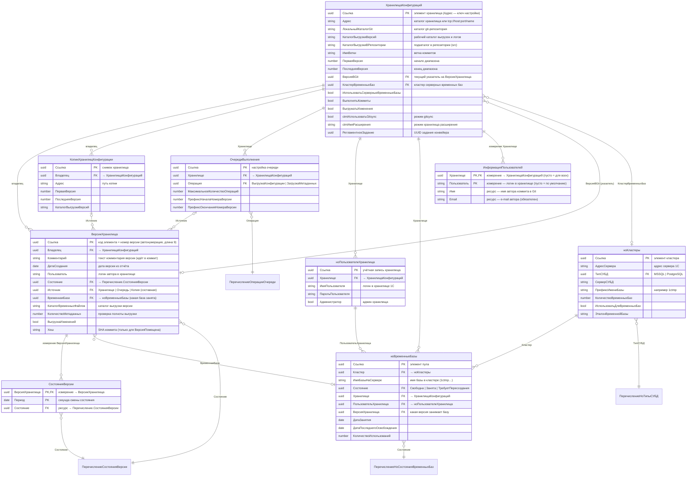

# ГитКонвертер: настройка и работа (руководство)

> **Составлено:** 28.09.2026. **Область:** конфигурация `1С:ГитКонвертер` (в исходниках — `ГитКонвертер`,
> версия **1.0.5.8**, вендор «Фирма "1С"») + внешний движок **gitsync**.
> **Источники:** `cfg_src/gitConverter` (XML-выгрузка), рабочая база `localhost\GitConv`,
> документы [BLOCKSCHEME.md](BLOCKSCHEME.md), [СОСТОЯНИЯ_ВЕРСИЙ.md](СОСТОЯНИЯ_ВЕРСИЙ.md),
> [ПОДДЕРЖКА_РАСШИРЕНИЙ.md](ПОДДЕРЖКА_РАСШИРЕНИЙ.md), [memory.md](memory.md),
> [КОНТЕКСТ_СЕССИИ.md](КОНТЕКСТ_СЕССИИ.md).
> **Назначение:** полное описание «как поставить, настроить и эксплуатировать» ГитКонвертер —
> от создания базы до разбора типовых сбоев. Технические детали алгоритма (координаты кода, пакетные
> скрипты конфигуратора) — в `BLOCKSCHEME.md`; здесь — пользовательская/административная часть.

---

## 1. Что делает ГитКонвертер

Конвертирует **историю хранилища конфигурации 1С** в **Git-репозиторий**: каждая версия хранилища
становится отдельным коммитом с автором/датой/комментарием из хранилища, а рабочее дерево — выгрузкой
конфигурации в файлы (`DumpConfigToFiles`, опционально формат 1C:EDT).

Схема одного шага:

```
Хранилище 1С ──(ConfigurationRepositoryReport)──> справочник ВерсииХранилища (диапазон версий)
            ──(ConfigurationRepositoryUpdateCfg во временную базу)──> временная база (пул)
            ──(DumpConfigToFiles)──> каталог выгрузки версии
            ──(git add / git commit)──> git-репозиторий (по коммиту на версию)
```

Есть **два способа** выполнения одной и той же задачи (см. §7):

| Способ | Кто делает работу | Когда применять |
|---|---|---|
| **Штатный конвейер 1С** | сама конфигурация ГитКонвертер (пакетные вызовы `1cv8.exe` + `git`) | основной режим; тонкий контроль, состояния версий в базе |
| **gitsync (гибрид)** | внешний движок gitsync под управлением 1С (`gitsync.bat`) | массовая первичная конвертация, когда важна скорость/многопоточность |

---

## 2. Состав решения

| Часть | Что это | Где |
|---|---|---|
| Конфигурация `ГитКонвертер` | «мозг»: справочники версий/хранилищ/временных баз, состояния, пакетные операции | база `localhost\GitConv` (файловая/серверная ИБ) |
| Пул временных баз | временные ИБ, в которых «проигрываются» версии хранилища | PostgreSQL/MSSQL-кластер + справочник `ноВременныеБазы` |
| Git | хранилище результата | `ХранилищаКонфигураций.ЛокальныйКаталогGit` (+ `АдресРепозиторияGit` для push) |
| gitsync | OneScript-скрипт `gitsync.bat` + плагины | `C:\tools\OneScript-1.9.4\bin\gitsync.bat` (пример рабочего стенда) |

Объекты метаданных конфигурации (полный перечень — Приложение А):

- **справочники:** `ХранилищаКонфигураций`, `ВерсииХранилища`, `ноКластеры`, `ноВременныеБазы`,
  `ноПользователиХранилища`, `ОчередиВыполнения`, `КопииХранилищКонфигурации`;
- **регистры сведений:** `ИнформацияПользователей` (автор коммита), `СостоянияВерсии` (журнал переходов);
- **перечисления:** `СостоянияВерсии`, `ноСостоянияВременныхБаз`, `ноТипыСУБД`, `ОперацииОчереди`;
- **константы:** 8 (см. §5.1), **функциональная опция** `ИспользоватьОчередиВыполнения`;
- **регламентные задания:** 4 (см. §5.5), **общие модули:** `КонвертацияХранилища` (ядро, 5400+ строк),
  `ОбработкаОчередей`, `ноСозданиеБазы`, `ДлительныеОперации`, служебные;
- **отчёт** `СкоростьКонвертации`, **обработки** `КонвертацияВФорматEDT`, `РегламентныеИФоновыеЗадания`;
- **роли:** `ПолныеПрава`, `АдминистраторСистемы`, `ИнтерактивноеОткрытиеВнешнихОтчетовИОбработок`.

### 2.1. Диаграмма «сущность — связь» (ER)

Связи построены по ссылочным реквизитам, измерениям регистров и владению (`data_links` конфигурации;
полный состав реквизитов — §5 и Приложение А).



**Расшифровка сущностей:**

| Сущность | Роль в схеме | Ключевые связи |
|---|---|---|
| `ХранилищаКонфигураций` | корневая настройка: одно хранилище 1С = один набор путей, диапазон версий, режим | владелец для версий и копий; ссылается на указатель `ВерсияВGit` и `КластерВременныхБаз` |
| `ВерсииХранилища` | по одной записи на версию хранилища; несёт состояние конвейера, хеш и каталог выгрузки | подчинён хранилищу (`Владелец`); `Источник` — составная ссылка (хранилище / очередь / копия) |
| `СостоянияВерсии` (регистр) | журнал смен состояний (периодичность — секунда) для аналитики и сводки | измерение `ВерсияХранилища`, ресурс `Состояние` |
| `ИнформацияПользователей` (регистр) | сопоставление логина хранилища автору git-коммита | измерение `Хранилище`; пустые значения — фолбэки |
| `ноВременныеБазы` | пул временных баз: кто занят, чем и когда | ссылки на кластер, хранилище, пользователя хранилища, версию |
| `ноКластеры` | параметры сервера 1С и СУБД для создания временных баз | тип СУБД, префикс имени, число баз |
| `ноПользователиХранилища` | учётные записи хранилища (по одной на поток) | привязка к хранилищу; используются базами пула |
| `ОчередиВыполнения` | настройка режима очередей (операции выгрузки/загрузки) | хранилище + операция очереди |
| `КопииХранилищКонфигурации` | снимок хранилища для выгрузки «в стороне» | подчинён хранилищу; может быть источником версии |

**Перечисления (значения):** `СостоянияВерсии` — 8 значений жизненного цикла (§8.1);
`ноСостоянияВременныхБаз` — `Свободна`, `Занята`, `ТребуетПересоздания`;
`ноТипыСУБД` — `MSSQL`, `PostgreSQL`; `ОперацииОчереди` — `ВыгрузкаКонфигурации`, `ЗагрузкаМетаданных`.

**Важные следствия для запросов и настройки:**

- `ВерсииХранилища` и `КопииХранилищКонфигурации` — **подчинённые** справочники: выборка версий всегда
  идёт через владельца (`ГДЕ Владелец = &Хранилище`), отсюда и кнопки формы работают в контексте элемента;
- реквизит `ВерсииХранилища.Источник` — **составная** ссылка: версия может принадлежать хранилищу,
  очереди выполнения или копии хранилища; по нему конвейер определяет, кто инициировал версию;
- `ХранилищаКонфигураций.РегламентноеЗадание` — это UUID системного регламентного задания (не ссылка на
  объект метаданных), поэтому в ER отдельной сущности у него нет;
- функциональная опция `ИспользоватьОчередиВыполнения` включает объекты очередей
  (`ОчередиВыполнения`, реквизиты `ОбрабатыватьВсеОчереди`, `ЗапретитьИспользованиеОбщихОчередей`,
  `ВерсииХранилища.ВыгрузкаИзменений`) — если опция выключена, эти поля в интерфейсе недоступны.

**Кто меняет эти сущности (сервисный слой):**

| Задание | Метод | Что пишет |
|---|---|---|
| `КонвертацияХранилища` | `КонвертацияХранилища.ВыполнитьКонвертацию` | `ВерсииХранилища` (состояния, хеш, каталог), регистр `СостоянияВерсии`, `ноВременныеБазы` |
| `ОбработкаОчереди` | `ОбработкаОчередей.ОбработатьОчередь` | состояния версий по операциям очереди |
| `ctmКонвертацияХранилищаGitsync` | `КонвертацияХранилища.ctmВыполнитьСинхронизациюГитсинкПоРегламенту` | `ВерсияВGit` и состояния версий по данным git |
| `ВыгрузкаВерсииИзКопииХранилища` | `КонвертацияХранилища.ВыгрузитьВерсиюИзКопииХранилища` | версии копий хранилищ и их состояния |

---

## 3. Требования к окружению

| Компонент | Требование | Комментарий |
|---|---|---|
| Платформа 1С | 8.3.12 и выше (проект проверен на **8.3.27.2214**) | режим совместимости конфигурации — `Version8_3_12`, интерфейс `Taxi`, модальность запрещена |
| Сервер 1С | желателен клиент-серверный вариант | фоновые задания полноценно работают только в клиент-серверном режиме ИБ; в файловой ИБ конвейер «живёт», но параллелизм ограничен |
| СУБД | PostgreSQL или MSSQL | нужна только для **серверных** временных баз (справочник `ноКластеры`, реквизит `ТипСУБД`) |
| Git | любой актуальный (в PATH сервера 1С) | `git init`, `add`, `commit`, `rev-parse` вызываются пакетно из 1С |
| OneScript + gitsync | OneScript **1.9.4** + пакет `gitsync` (`gitsync.bat`), плагины | только для режима gitsync |
| Файловое хранилище 1С | доступ по пути (или `tcp://…`) и учётные записи с правами | пользователь хранилища нужен для каждой параллельной операции |
| Диск | каталоги выгрузки/репозитория на быстром диске | выгрузка версии — самый тяжёлый этап (6–7 мин в среднем, до 16 ч на больших версиях) |

Минимальный чек-лист «всё на месте»: `1cv8.exe` доступен серверу, `git --version` работает под той же
учётной записью, куда пишет сервер 1С, каталоги `КаталогВыгрузкиВерсий` и `ЛокальныйКаталогGit` существуют
и доступны на запись.

---

## 4. Установка конфигурации

1. **Создать информационную базу** (файловую или серверную) — это будет база ГитКонвертера
   (в проекте это `localhost\GitConv`, пользователь `Администратор`).
2. **Загрузить конфигурацию**: из `.cf`-дампа (`/LoadCfg "…\ГитКонверер1Cv8.cf" /UpdateDBCfg`) или из
   XML-исходников (`/LoadConfigFromFiles "<cfg_src\gitConverter>" /UpdateDBCfg`). Ведение разработки в этой
   базе возможно, редактирование на поддержке не используется.
3. **Проверить пользователей ИБ и роли**: администратору нужна роль `ПолныеПрава` или `АдминистраторСистемы`;
   конвейеру — права на чтение/запись справочников, регистров, выполнение регламентных и фоновых заданий.
4. **Включить состав «Все функции»** (для доступа к справочникам/регистрам без форм — например,
   `ИнформацияПользователей` форм не имеет).
5. **Проверить доступность внешних процессов** под учётной записью сервера 1С: `1cv8.exe`, `git`, при
   необходимости `gitsync.bat`.
6. **Разрешить выполнение внешних процессов**: конвейер вызывает `1cv8.exe`/`cmd`/`bash` из серверного кода
   (`ЗапуститьПриложение`), поэтому сервер должен иметь право запускать приложения.

> После загрузки конфигурации в базе появляются 4 регламентных задания (все выключены — включаются по мере
> настройки, §6.6).

---

## 5. Объектная модель: что где настраивается

> Карта связей объектов (ER-диаграмма) — в §2.1. Ниже — назначение каждого объекта и его реквизитов.

### 5.1. Константы (глобальные настройки сервера)

| Константа | Тип | Назначение |
|---|---|---|
| `ПутьКВерсиямПлатформыНаСервере` | Строка | каталог, где лежат версии платформы (`C:\Program Files\1cv8`); из него выбирается нужная версия `1cv8.exe` |
| `ctmПутьКОнеСкриптНаСервере` | Строка | каталог с `gitsync.bat` (bin OneScript), напр. `C:\tools\OneScript-1.9.4\bin`; **обязательна для режима gitsync** |
| `ctmПутьКПлагинамGitsync` | Строка | общий каталог плагинов gitsync (`GITSYNC_PLUGINS_PATH`), напр. `C:\tools\gitsync_plugins` |
| `ctmБазаGitsyncНаСервере` | Ссылка на `ноВременныеБазы` | временная база, из которой gitsync читает историю хранилища (ключ `-C`); в потоках выгрузки не участвует |
| `ИспользоватьОчередиВыполнения` | Булево | включает режим очередей (функциональная опция `ИспользоватьОчередиВыполнения`) |

**Устаревшие (не использовать, оставлены от прежних версий):** `БазаGitsyncНаСервере`,
`ИмяБазыGitsyncНаСервере`, `ПутьКОнеСкриптНаСервере` — заменены константами с префиксом `ctm`
(Правило 3 проекта: новые имена — только с `ctm`).

### 5.2. Справочник `ноКластеры` — параметры серверных временных баз

| Реквизит | Смысл |
|---|---|
| `АдресСервера` | адрес сервера 1С кластера (например `localhost`) |
| `ТипСУБД` | `MSSQL` / `PostgreSQL` (`Перечисление.ноТипыСУБД`) |
| `СерверСУБД`, `ИмяПользователяСУБД`, `ПарольПользователяСУБД` | доступ к СУБД для `CREATEINFOBASE` |
| `ИмяПользователяКластера`, `ПарольПользователяКластера` | администратор кластера (если требуется) |
| `ПрефиксИмениБазы` | префикс имён создаваемых баз (например `1ctmp`) |
| `КоличествоВременныхБаз` | сколько баз создавать в кластере |
| `ИспользоватьДляВременныхБаз` | кластер участвует в пуле временных баз |
| `ЭталонВременнойБазы` | имя базы-эталона (для создания «по образцу») |
| `Комментарий` | произвольная заметка |

### 5.3. Справочник `ноВременныеБазы` — пул временных баз

| Реквизит | Смысл |
|---|---|
| `Кластер` | ссылка на `ноКластеры`; обязателен |
| `ИмяБазыНаСервере` | полное имя базы в кластере (напр. `1ctmp_vremennaya`) |
| `Состояние` | `Свободна` / `Занята` / `ТребуетПересоздания` (`Перечисление.ноСостоянияВременныхБаз`) |
| `Хранилище` | к какому хранилищу приписана база |
| `ПользовательХранилища` | элемент `ноПользователиХранилища` (под кем база работает с хранилищем) |
| `ИмяПользователяХранилища`, `ПарольПользователяХранилища` | учётные данные (текстом) |
| `ВерсияХранилища`, `ДатаЗанятия`, `ДатаПоследнегоОсвобождения`, `КоличествоИспользований` | служебные: какая версия занимала базу, когда, сколько раз |

Кнопки формы элемента: **«Создать базу»** (пакетный `CREATEINFOBASE` по параметрам кластера) и
**«Сделать пользователя хранилища»** (создаёт/обновляет элемент `ноПользователиХранилища` для этой базы).

Правила пула:

- конвейер сам берёт свободную базу (`ноВременныеБазы.НайтиСвободную(Кластер, Хранилище)`), помечает
  `Занята`, а по завершении — `Свободна`;
- `МаксимальноеКоличествоПодготавливаемыхВерсий` (реквизит хранилища) **не может превышать** число баз пула;
- серверные базы перед работой **обнуляются**: отвязка от хранилища (`ConfigurationRepositoryUnbindCfg -force`)
  + загрузка пустой конфигурации из общего макета `ctmПустаяКонфигурация` (`ctmРазвернутьПустуюКонфигурацию`
  → `ctmОбнулитьВременнуюБазу`);
- состояние `ТребуетПересоздания` означает, что базу нужно обнулить/пересоздать (кнопка «Создать базу» или
  «Освободить временные базы» на форме хранилища).

### 5.4. Справочник `ноПользователиХранилища` — учётные записи хранилища

Реквизиты: `Хранилище`, `ИмяПользователя` (логин **в хранилище 1С**), `ПарольПользователя`,
`Администратор` (флаг «админ хранилища»). Форм нет — записи вводятся набором записей либо создаются кнопкой
«Сделать пользователя хранилища» из формы временной базы. Смысл: дать каждой параллельной операции
**своего** пользователя хранилища (несколько одновременных сеансов одного логина блокируют друг друга).

### 5.5. Регламентные задания

| Задание | Метод | Роль |
|---|---|---|
| `КонвертацияХранилища` | `ОбщийМодуль.КонвертацияХранилища.ВыполнитьКонвертацию` | штатный оркестратор: получить версии → выгрузить → закоммитить |
| `ОбработкаОчереди` | `ОбщийМодуль.ОбработкаОчередей.ОбработатьОчередь` | режим очередей (операции «ВыгрузкаКонфигурации»/«ЗагрузкаМетаданных») |
| `ctmКонвертацияХранилищаGitsync` | `КонвертацияХранилища.ctmВыполнитьСинхронизациюГитсинкПоРегламенту` | синхронизация gitsync по всем хранилищам с флагом `ctmИспользоватьGitsync` |
| `ВыгрузкаВерсииИзКопииХранилища` | `КонвертацияХранилища.ВыгрузитьВерсиюИзКопииХранилища` | выгрузка версии из «копии хранилища» (резервный сценарий) |

Расписание задаётся **на форме элемента хранилища**: реквизит `РегламентноеЗадание` (UUID задания) +
поле «Расписание» с кнопкой редактора расписания. Для конвейера типично расписание «каждую минуту»
(на рабочем стенде фактический цикл — ~5 минут).

### 5.6. Прочие объекты

- `ОчередиВыполнения` — настройки режима очередей: `Хранилище`, `Операция`, `МаксимальноеКоличествоОпераций`,
  `РегламентноеЗадание`, `ПрефиксНачалаНомераВерсии`, `ПрефиксОкончанияНомераВерсии`.
- `КопииХранилищКонфигурации` — «копия хранилища» (снимок) для выгрузки версий без нагрузки на рабочее
  хранилище: `Адрес`, `ПерваяВерсия`, `ПоследняяВерсия`, `КаталогВыгрузкиВерсий`, учётные данные,
  `РегламентноеЗадание`.
- `РегистрСведений.СостоянияВерсии` — история смен состояний (измерение `ВерсияХранилища`, ресурс
  `Состояние`, периодичность — секунда). Основа аналитики (см. [АНАЛИТИКА_ЭТАПОВ.md](АНАЛИТИКА_ЭТАПОВ.md)).
- `РегистрСведений.ИнформацияПользователей` — соответствие логина хранилища автору git-коммита (§6.4).

---

## 6. Пошаговая настройка хранилища

> Порядок шагов обязателен: конвейер читает настройки с самого начала работы, и «пустые» реквизиты дают
> либо ошибку в журнале регистрации, либо молчаливое отсутствие коммитов.

### 6.1. Шаг 0. Константы сервера

Заполнить `ПутьКВерсиямПлатформыНаСервере`; для режима gitsync — `ctmПутьКОнеСкриптНаСервере`,
`ctmПутьКПлагинамGitsync`, `ctmБазаGitsyncНаСервере`. Проверка: файл `<ctmПутьКОнеСкриптНаСервере>\gitsync.bat`
существует (иначе конвейер поднимет ошибку «Не найден gitsync: …»).

### 6.2. Шаг 1. Кластеры и временные базы (серверный режим)

1. Завести элемент `ноКластеры`: адрес сервера 1С, тип СУБД, доступ к СУБД, префикс имени базы,
   количество баз.
2. Кнопкой **«Создать базу»** на форме элемента `ноВременныеБазы` создать нужное число баз (или создать
   базы вручную через `CREATEINFOBASE` и заполнить справочник).
3. Для каждой базы заполнить `Хранилище`, `ПользовательХранилища`, `ИмяПользователяХранилища`,
   `ПарольПользователяХранилища`. Проще всего — кнопка **«Сделать пользователя хранилища»**.
4. Обнулить базы пустой конфигурацией: `ConfigurationRepositoryUnbindCfg -force` +
   `LoadCfg "<пустая>.cf" /UpdateDBCfg` (пустая конфигурация разворачивается из макета `ctmПустаяКонфигурация`
   функцией `ctmРазвернутьПустуюКонфигурацию`).

Число баз пула определяет параллелизм: `МаксимальноеКоличествоПодготавливаемыхВерсий` ≤ число баз.
Для файлового режима (`ИспользоватьСерверныеВременныеБазы = Ложь`) база создаётся на каждый шаг
(`СоздатьФайловуюИнформационнуюБазу`) — пул не нужен, но скорость ниже.

### 6.3. Шаг 2. Пользователи хранилища и авторы коммитов — **самое первое по важности**

Хранилище 1С знает своих пользователей по логину, а Git требует имя и e-mail. Поэтому:

1. `ноПользователиХранилища` — завести учётные записи хранилища (по одной на параллельный поток;
   плюс «админ хранилища» с флагом `Администратор`).
2. `РегистрСведений.ИнформацияПользователей` — для **каждого** логина из истории версий указать пару
   `Имя` + `Email` (ресурсы обязательны). Форм у регистра нет: «Все функции» → Регистры сведений →
   Информация пользователей (или кнопка «Получить все версии и заполнить пользователей» — она
   предзаполняет записи по полю `Пользователь` версий, см. §8.2).
3. Поддерживаются фолбэки: запись с пустым `Хранилище` — общая для всех хранилищ; с пустым `Пользователем` —
   значение по умолчанию.

Что будет, если не заполнить:

- логин останется логином хранилища, e-mail станет `anonimous@localhost`;
- если у хранилища выключен флаг `РазрешитьПомещатьАнонимноЕслиНеНайденПользователь` — **коммиты не
  выполняются вовсе**, молча (ни ошибки, ни записи в ЖР).

Значения уходят в коммит как `GIT_AUTHOR_NAME`/`GIT_AUTHOR_EMAIL` и `GIT_COMMITTER_*`.

### 6.4. Шаг 3. Реквизиты элемента `ХранилищаКонфигураций`

Все 33 реквизита по группам:

**Пути и адреса**

| Реквизит | Смысл | Пример стенда |
|---|---|---|
| `Адрес` (обяз.) | адрес хранилища: каталог или `tcp://host:port/name` | `E:\rep\task` |
| `ЛокальныйКаталогGit` (обяз.) | каталог локального git-репозитория | `E:\rep\task_git_file210` |
| `КаталогВыгрузкиВерсий` (обяз.) | рабочий каталог выгрузок и служебных файлов | `E:\rep\task_temp_file210` |
| `КаталогВыгрузкиВРепозитории` (обяз.) | подкаталог репозитория, куда кладётся выгрузка (`src`) | `src` |
| `ИмяВетки` (обяз.) | ветка, в которую идут коммиты | `master` |
| `ВерсияПлатформы` | версия платформы для пакетных операций (пусто — последняя из `ПутьКВерсиямПлатформыНаСервере`) | `8.3.27.2214` |
| `АдресРепозиторияGit`, `ПользовательСервераGit`, `ПарольСервераGit` | remote для push и учётные данные к нему | — |
| `Описание` | произвольная заметка | — |

**Учётные данные и идентификация**

| Реквизит | Смысл |
|---|---|
| `ИмяПользователяХранилища` (обяз.) | логин **администратора** хранилища (для отчётов и служебных операций) |
| `ПарольПользователяХранилища` | его пароль |

**Диапазон версий**

| Реквизит | Смысл |
|---|---|
| `ПерваяВерсия` | с какой версии начинать (0 — с первой доступной) |
| `ПоследняяВерсия` | по какую версию конвертировать |
| `ВерсияВGit` | указатель «докуда закоммичено» (ссылка на `ВерсииХранилища`) |

**Режимы работы**

| Реквизит | Смысл |
|---|---|
| `ВыполнятьКоммиты` | выполнять ли git-коммиты (иначе — только подготовка выгрузок) |
| `ВыгружатьИзменения` | выгружать только изменения (`-getChanges`), а не полную конфигурацию |
| `ИспользоватьСерверныеВременныеБазы` | `Истина` — работать через пул серверных баз; `Ложь` — файловые временные базы |
| `КластерВременныхБаз` | кластер, из которого берутся базы (для серверного режима) |
| `КонвертироватьВФорматEDT` | после выгрузки импортировать версию в формат 1C:EDT (`ring edt workspace import`) |
| `УдалятьКонфигурацииПоставщиков` | удалять из выгрузки файлы на поддержке поставщика |
| `ОбрабатыватьВсеОчереди`, `ЗапретитьИспользованиеОбщихОчередей` | поведение в режиме очередей (общие очереди и чужие хранилища) |

**Производительность и порядок**

| Реквизит | Смысл |
|---|---|
| `МаксимальноеКоличествоПодготавливаемыхВерсий` | сколько версий держать «в подготовке» одновременно (≤ числа баз пула) |
| `КоличествоКоммитов` | ограничение числа коммитов за прогон (0 — без ограничения) |
| `МинимальноеКоличествоМетаданных` | порог «пустой» выгрузки: меньше — версия сбрасывается в «ПустаяСсылка» |
| `УдалятьВременныеДанныеВерсииПослеКоммита` | чистить каталог выгрузки версии после коммита |
| `ОстановитьКонвертацию` | «стоп-кран»: при `Истина` задания конвертации не выполняются |
| `РазрешитьПомещатьАнонимноЕслиНеНайденПользователь` | разрешать коммит от `anonimous@localhost`, если логина нет в регистре |
| `РегламентноеЗадание` | UUID регламентного задания конвейера (задаётся формой) |

**Расширения и gitsync**

| Реквизит | Смысл |
|---|---|
| `ctmИмяРасширения` | имя хранилища **расширения** конфигурации; заполнено → конвейер работает в режиме расширения |
| `ctmКаталогЗасеваРасширения` | каталог XML-выгрузки расширения для засева временной базы |
| `ctmИспользоватьGitsync` | `Истина` — это хранилище обрабатывает регламентное задание `ctmКонвертацияХранилищаGitsync` |

Форма проверяет обязательность (`ОбработкаПроверкиЗаполненияНаСервере`): без `Адрес`, `КаталогВыгрузкиВерсий`,
`ЛокальныйКаталогGit`, `ИмяВетки`, `КаталогВыгрузкиВРепозитории`, `ИмяПользователяХранилища` запись не пройдёт.

### 6.5. Шаг 4. Создание git-репозитория

Кнопка **«Создать репозиторий git»** (подсказка: «Создать репозиторий Git и установить начальные настройки»):

- выполняет `git init` в `ЛокальныйКаталогGit`;
- задаёт локальные настройки (в т.ч. `core.quotepath`, `core.autocrlf`, `diff.renames`);
- создаёт `.gitignore` и `.gitattributes`;
- при необходимости — начальный коммит/проверку.

Дополнительно:

- **«Установить адрес репозитория git»** — прописывает `remote origin` из `АдресРепозиторияGit`
  (если используется push в общий репозиторий);
- ветка коммитов берётся из `ИмяВетки`; при повторном прогоне в тот же каталог история дописывается;
- ⚠️ на Windows-сервере репозиторий, созданный другим пользователем ОС, Git считает «чужим»
  (`dubious ownership`) — лечится настройкой `safe.directory` (см. [КОНТЕКСТ_СЕССИИ.md](КОНТЕКСТ_СЕССИИ.md) §19).

### 6.6. Шаг 5. Диапазон версий и запуск

1. Заполнить `ПерваяВерсия` / `ПоследняяВерсия`.
2. Кнопкой **«Получить все версии и заполнить пользователей»** (или **«Загрузить версии из отчета по
   хранилищу»**) сформировать отчёт по хранилищу и заполнить `Справочник.ВерсииХранилища` и регистр
   `ИнформацияПользователей`.
3. Нажать **«Запустить конвертацию»** — запустится фоновое задание `ВыполнитьКонвертацию`
   (либо включить регламентное задание `КонвертацияХранилища` с расписанием).
4. Контроль: кнопка **«Обновить состояние»** (или переключатель «Обновлять состояние автоматически
   (каждые 20 сек)») на форме хранилища + Журнал регистрации (Правила 2 и 5 проекта).

> ⚠️ **Перед повторным прогоном диапазона обязательно очищать `КаталогВыгрузкиВерсий`**: конвейер
> переиспользует уже существующие `git_command_N.bat` / `git_comment_N.txt` и коммиты уйдут со старым
> текстом сообщения (в проекте это уже приводило к трём одинаковым коммитам версии 861).

---

## 7. Режимы работы конвейера

### 7.1. Файловый режим

`ИспользоватьСерверныеВременныеБазы = Ложь`. Под каждую версию создаётся своя файловая ИБ
(`CREATEINFOBASE File="…"`), в неё загружается конфигурация версии, выгружается в XML, затем база удаляется.
Плюс: не нужна СУБД/кластер. Минус: медленнее, меньше параллелизма.

### 7.2. Серверный режим (пул временных баз) — рекомендуемый

`ИспользоватьСерверныеВременныеБазы = Истина`, `КластерВременныхБаз` заполнен. Базы уже существуют
в кластере, конвейер берёт свободную, обновляет её до нужной версии хранилища
(`ConfigurationRepositoryUpdateCfg -force -v N`) и освобождает. Параллелизм = число баз в пуле.
Требуется сервер 1С + СУБД, и каждая база работает **под своим** пользователем хранилища.

### 7.3. Режим очередей

Функциональная опция `ИспользоватьОчередиВыполнения` + справочник `ОчередиВыполнения`. Тяжёлые этапы
выносятся в очереди по операциям: «ВыгрузкаКонфигурации» (`ВерсияПолучена` → `ВерсияВыгружена`) и
«ЗагрузкаМетаданных» (`ВерсияВыгружена` → `МетаданныеЗагружены`). Разбирает очереди регламентное задание
`ОбработкаОчереди`. Смысл — распределить нагрузку и не занимать пул баз на время длинных выгрузок.

### 7.4. Режим хранилища расширения конфигурации

Заполнен `ctmИмяРасширения` (и, при необходимости, `ctmКаталогЗасеваРасширения`). Порядок:

1. расширение засевается во временную базу (`ibcmd extension create` или
   `/LoadConfigFromFiles "<каталог засева>" -AllExtensions /UpdateDBCfg`);
2. версия берётся не через `ConfigurationRepositoryUpdateCfg`, а через
   `ConfigurationRepositoryDumpCfg -v<N> -Extension "<имя>"` + `/LoadCfg`;
3. далее обычная выгрузка в XML и коммит.

Критично: ключ `-Extension "<имя>"` должен стоять **строго после** ключей хранилища
(`/ConfigurationRepositoryReport out.mxl -NBegin 1 -Extension ExtDopFunkcional`), иначе платформа
ответит «Соединение основной конфигурации с хранилищем расширений конфигураций невозможно»
(подробно — [ПОДДЕРЖКА_РАСШИРЕНИЙ.md](ПОДДЕРЖКА_РАСШИРЕНИЙ.md)).

### 7.5. Режим gitsync (гибрид)

Включается флагом `ctmИспользоватьGitsync = Истина`; работает регламентным заданием
`ctmКонвертацияХранилищаGitsync`. Обязательные условия: **серверные** временные базы (кластер),
константы `ctmПутьКОнеСкриптНаСервере`, `ctmБазаGitsyncНаСервере` (при пустом значении — ошибка
«Режим gitsync поддерживается только при использовании серверных временных баз»).

Что делает конвейер (`ctmВыполнитьСинхронизациюГитсинк`):

1. обнуляет все свободные базы пула (отвязка + пустая конфигурация);
2. формирует в `КаталогВыгрузкиВерсий` два файла: `gitsync_connections.txt` (строки `/S <сервер>\<база>`)
   и `gitsync_run.bat` (ANSI);
3. запускает команду вида:

```
"<ctmПутьКОнеСкриптНаСервере>\gitsync.bat" --v8-path "<1cv8.exe>" [--v8version "<версия>"]
  -C "/S <АдресСервера>\<база истории>" s -n <число баз>
  --connections-file "<…\gitsync_connections.txt>"
  --storage-users "<u1,u2,…>" --storage-pwds "<p1,p2,…>"
  [--minversion <N>] [--maxversion <M>]
  -u "<пользователь хранилища>" [-p "<пароль>"] "<адрес хранилища>" "<локальный каталог git>"
```

   (перед запуском в `PATH` добавляется каталог OneScript, в `GITSYNC_PLUGINS_PATH` — каталог плагинов);
4. пишет журналы `gitsync.log` и `gitsync_orchestrator.txt` в `КаталогВыгрузкиВерсий`;
5. по завершении обновляет базу по git-истории: `ВерсияВGit` и состояния версий
   (`ctmЗаписатьОбратноСостояния`).

Диапазон gitsync-прогона: от `ВерсияВGit + 1` (или `ПерваяВерсия`) до `ПоследняяВерсия`.

---

## 8. Эксплуатация

### 8.1. Жизненный цикл версии

```
ПустаяСсылка → ПолучениеВерсии → ВерсияПолучена → ВыгрузкаВерсии → ВерсияВыгружена
             → ЗагрузкаМетаданных → МетаданныеЗагружены → НачалоКоммита → ВерсияПомещена
```

Полное описание переходов, откатов и координат кода — [СОСТОЯНИЯ_ВЕРСИЙ.md](СОСТОЯНИЯ_ВЕРСИЙ.md).
Ключевое для администратора:

- `Состояние` версии видно в форме списка `ВерсииХранилища`; вся история — в регистре `СостоянияВерсии`;
- «процессные» состояния (`ВыгрузкаВерсии`, `ЗагрузкаМетаданных`, `НачалоКоммита`) при падении задания
  откатываются автоматически к предыдущему «готовому» (2, 4, 6);
- версия, «застрявшая» в состоянии «Начало коммита» при существующем файле лога, автоматически **не**
  переобрабатывается — нужен ручной сброс («Обнулить диапазон версий»);
- `Хеш` очищается при любом состоянии, кроме `ВерсияПомещена`.

### 8.2. Кнопки формы элемента хранилища

| Кнопка | Что делает |
|---|---|
| **Запустить конвертацию** | фоновое задание `ВыполнитьКонвертацию` (полный конвейер: версии → выгрузка → коммит) |
| **Выполнить коммиты** | только поток коммитов (по версиям в состоянии «Метаданные загружены») |
| **Обновить состояние** | пересчёт сводки на форме (что в работе, что закоммичено) |
| **Обновлять состояние автоматически (каждые 20 сек)** | автообновление сводки |
| **Загрузить версии из отчета по хранилищу** | отчёт по версиям → `ВерсииХранилища` |
| **Получить все версии и заполнить пользователей** | отчёт по **всем** версиям + заполнение `ВерсииХранилища` + предзаполнение регистра `ИнформацияПользователей` |
| **Обнулить диапазон версий** | сброс состояний версий диапазона «Первая…Последняя» для повторного получения/коммита + выставление указателей продолжения (`ВерсияВGit`, код элемента) |
| **Создать репозиторий git** | `git init` + начальные настройки + `.gitignore`/`.gitattributes` |
| **Установить адрес репозитория git** | прописать `remote origin` из `АдресРепозиторияGit` |
| **Освободить временные базы** | освободить все базы, занятые версиями этого хранилища (при «залипших» заданиях) |
| **Обнулить счётчик временных баз** | обнулить `КоличествоИспользований` у баз хранилища (перебалансировать пул) |
| **Конвертировать в формат 1C:EDT** | помощник конвертации репозитория в формат EDT |
| **Проверить доступную версию 1C:EDT** | проверка доступной версии EDT |
| **Выполнить синхронизацию gitsync** | разовая синхронизация через gitsync (команда есть; **подпись кнопки не задана** — отображается имя команды, дефект оформления) |

На форме элемента `ноВременныеБазы`: **«Создать базу»** и **«Сделать пользователя хранилища»** (§5.3).

### 8.3. Мониторинг и контроль

| Что смотреть | Где | Норма / признак проблемы |
|---|---|---|
| Состояния версий | форма `ВерсииХранилища`, регистр `СостоянияВерсии` | «Версия помещена» — конечное; процессные состояния не держатся часами |
| Сводка по хранилищу | форма элемента хранилища (запрос «Сводка», см. [QUERY_SVODKA.md](QUERY_SVODKA.md)) | — |
| Скорость этапов | отчёт **`СкоростьКонвертации`** | рост среднего времени выгрузки/коммита — деградация (диск, объём конфигурации) |
| Журнал регистрации 1С | «Администрирование» → Журнал регистрации (уровни Ошибка/Предупреждение) | **обязательная проверка в конце каждого шага (Правило 2)** |
| Логи пакетных операций | `КаталогВыгрузкиВерсий\<версия>\log.txt`, `git_log_ver_<N>.txt`, `git_command_<N>.bat`, `git_comment_<N>.txt` | «Код возврата: 0» — ещё не гарантия успеха: код берётся от **последней** команды `.bat` |
| Логи gitsync | `gitsync.log`, `gitsync_orchestrator.txt` | ненулевой код возврата gitsync = исключение с текстом в журнале оркестратора |
| Git-история | `git log --oneline`, `git status`, `git fsck` в `ЛокальныйКаталогGit` | рабочее дерево чистое, коммит на версию, HEAD = последняя помещённая версия |

Признак нормального «простоя»: конвейер каждые ~5 минут строит отчёт `-NBegin <ВерсияВGit+1>`, получает
**пустой отчёт** («Отчет успешно построен») и в ЖР пишет «Конвертация хранилища не выполняется. Необходимо
освободить временные базы хранилища: …» (уровень «Информация»). Это значит «новых версий нет», а не сбой.

---

## 9. Диагностика: симптом → причина → что делать

| Симптом | Наиболее вероятная причина | Действие |
|---|---|---|
| Коммитов нет, ошибок в ЖР нет | логин хранилища не найден в `ИнформацияПользователей`, а `РазрешитьПомещатьАнонимноЕслиНеНайденПользователь = Ложь` | заполнить регистр (§6.3) или включить флаг |
| Автор коммитов — логин хранилища / `anonimous@localhost` | не заполнен регистр `ИнформацияПользователей` | заполнить `Имя`/`Email` для каждого логина |
| «Остановилось», новых коммитов нет | **в хранилище нет версий новее последней** — конвейер получает пустой отчёт | это норма; проверить последнюю версию хранилища (кэш `cache\ddb<номер>.snp`) и `ВерсияВGit` |
| В ЖР «Конвертация хранилища не выполняется. Необходимо освободить временные базы…» (Информация) | нет активной конвертации | норма (штатная ветка); при «залипших» базах — кнопка «Освободить временные базы» |
| Версия висит в «Начало коммита» / «Выгрузка версии» | падение фонового задания; авто-восстановление пропускает такую версию, если лог коммита существует | «Обнулить диапазон версий» для этой версии (или диапазона) и повторный прогон |
| Коммит ушёл со **старым** текстом сообщения; несколько одинаковых коммитов | конвейер переиспользовал существующие `git_command_N.bat` / `git_comment_N.txt` | очистить `КаталогВыгрузкиВерсий` перед повторным прогоном |
| «Успех» в логе, но коммита/версии в git нет | код возврата взят от последней команды `.bat` (`git gc --auto`), а не от `git commit`/`git add` | смотреть `git_log_ver_<N>.txt` и `git log`; доработка — брать код возврата из `git add`/`git commit` |
| `fatal: Out of memory, realloc failed` в `git_log_ver_<N>.txt` | git не смог проиндексировать большой объём (полный дамп конфигурации) | включить `ВыгружатьИзменения = Истина`, увеличить память/`core.bigFileThreshold`, повторить версию |
| «Соединение основной конфигурации с хранилищем расширений конфигураций невозможно» | ключ `-Extension` стоит **перед** ключами хранилища либо расширения нет в базе | поставить `-Extension "<имя>"` **в конец** команды хранилища; засеять расширение в базу |
| «Не найден gitsync: …» | не заполнена/неверна `ctmПутьКОнеСкриптНаСервере` | указать каталог с `gitsync.bat` (напр. `C:\tools\OneScript-1.9.4\bin`) |
| «Режим gitsync поддерживается только при использовании серверных временных баз» | у хранилища нет кластера временных баз | заполнить `КластерВременныхБаз` + `ИспользоватьСерверныеВременныеБазы` |
| «Не заполнена константа «База gitsync на сервере (история)»» | не задана `ctmБазаGitsyncНаСервере` | выбрать элемент `ноВременныеБазы` для истории |
| «gitsync завершился с кодом N» | ошибка движка/плагинов | смотреть `gitsync_orchestrator.txt` и `gitsync.log` в `КаталогВыгрузкиВерсий` |
| `CREATEINFOBASE`: база уже существует (код 100000) | повторное создание базы, которая есть в кластере | не создавать повторно; если нужна чистая — обнулить/пересоздать |
| «При обновлении ИБ из хранилища конфигураций возникли ошибки… `<версия>\log.txt`» | сбой `ConfigurationRepositoryUpdateCfg` (блокировка версии, занятость пользователя, сеть) | прочитать `log.txt` версии; повторить версию (обычно проходит со второго раза) |
| IDE не показывает историю репозитория («dubious ownership») | репозиторий создан другим пользователем ОС | `git config --global --add safe.directory <путь>` |
| Версия «переполучена»/сброшена сама | `КоличествоМетаданных` меньше `МинимальноеКоличествоМетаданных` (пустая выгрузка) | проверить выгрузку версии; при необходимости снизить порог |
| Фоновые задания не выполняются | файловая ИБ либо выключено выполнение заданий | перевести базу в клиент-серверный вариант / включить задания |

**Порядок разбора любого сбоя (по правилам проекта):**

1. Журнал регистрации 1С за период (Ошибка/Предупреждение) — Правило 2;
2. логи пакетных операций в `КаталогВыгрузкиВерсий` (`<версия>\log.txt`, `git_log_ver_N.txt`);
3. `git log` / `git status` в `ЛокальныйКаталогGit`;
4. при «долгой обработке» (> 2 прогонов) — дополнительно ЖР и внешние логи (Правило 5);
5. если обработка «не отвечает» больше минуты — скриншот активного окна (Правило 4).

---

## 10. Приложения

### Приложение А. Состав метаданных конфигурации «ГитКонвертер» 1.0.5.8

| Вид | Объекты |
|---|---|
| Справочники | `ХранилищаКонфигураций`, `ВерсииХранилища`, `ноКластеры`, `ноВременныеБазы`, `ноПользователиХранилища`, `ОчередиВыполнения`, `КопииХранилищКонфигурации` |
| Регистры сведений | `ИнформацияПользователей`, `СостоянияВерсии` |
| Перечисления | `СостоянияВерсии`, `ноСостоянияВременныхБаз`, `ноТипыСУБД`, `ОперацииОчереди` |
| Константы | `ПутьКВерсиямПлатформыНаСервере`, `ctmПутьКОнеСкриптНаСервере`, `ctmПутьКПлагинамGitsync`, `ctmБазаGitsyncНаСервере`, `ИспользоватьОчередиВыполнения` (+ устаревшие `БазаGitsyncНаСервере`, `ИмяБазыGitsyncНаСервере`, `ПутьКОнеСкриптНаСервере`) |
| Регламентные задания | `КонвертацияХранилища`, `ОбработкаОчереди`, `ctmКонвертацияХранилищаGitsync`, `ВыгрузкаВерсииИзКопииХранилища` |
| Общие модули | `КонвертацияХранилища` (ядро), `ОбработкаОчередей`, `ноСозданиеБазы`, `ДлительныеОперации`, `ДлительныеОперацииКлиент`, `ОбщегоНазначения` (+ 10 служебных) |
| Обработки | `КонвертацияВФорматEDT`, `РегламентныеИФоновыеЗадания` |
| Отчёты | `СкоростьКонвертации` |
| Макеты | `ctmПустаяКонфигурация` (общий макет — пустая конфигурация для обнуления временных баз) |
| Роли | `ПолныеПрава`, `АдминистраторСистемы`, `ИнтерактивноеОткрытиеВнешнихОтчетовИОбработок` |
| Функциональная опция | `ИспользоватьОчередиВыполнения` |

Свойства конфигурации: `DefaultRunMode = ManagedApplication`, `CompatibilityMode = Version8_3_12`,
`InterfaceCompatibilityMode = Taxi`, `ModalityUseMode = DontUse`.

### Приложение Б. Рабочие ориентиры стенда проекта (28.09.2026)

| Параметр | Значение |
|---|---|
| База конвертера | `localhost\GitConv` (пользователь `Администратор`) |
| Платформа | `C:\Program Files\1cv8\8.3.27.2214\bin` |
| Хранилище основной конфигурации (тестовое) | `E:\rep\task`, админ `danilin` |
| Git-репозиторий / каталог выгрузки | `E:\rep\task_git_file210` / `E:\rep\task_temp_file210` |
| Боевое хранилище | `E:\repository\erp25` → git `E:\rep\erp25_git` (`master`), выгрузка `E:\rep\erp25_temp` |
| Хранилище расширения | `E:\rep\erp25ExtDopFunkcional` (расширение `ExtDopFunkcional`) |
| OneScript / gitsync | `C:\tools\OneScript-1.9.4\bin\gitsync.bat`; плагины `C:\tools\gitsync_plugins` |
| Кластер временных баз | `АдресСервера = localhost`, префикс `1ctmp`, СУБД PostgreSQL |
| Пул временных баз (пример) | `1ctmp_gitsync` (история gitsync), `1ctmp_vremennaya`, `1ctmp_vremennaya2`, `1ctmp_vremennaya3` |
| MCP-инструменты сессии | `code-index` (репо `main` = `cfg_src`), `bsl-language-server`, 1С MCP Toolkit |

> ⚠️ Защищённые артефакты (дампы `.cf`, каталоги действующих баз) — см.
> [ЗАЩИЩЁННЫЕ_АРТЕФАКТЫ.md](ЗАЩИЩЁННЫЕ_АРТЕФАКТЫ.md). Не удалять и не «чистить».

### Приложение В. Файлы на диске

| Файл / каталог | Где | Что содержит |
|---|---|---|
| `git_command_<N>.bat` / `.sh` | `КаталогВыгрузкиВерсий` | команда коммита версии N (генерируется конвейером) |
| `git_comment_<N>.txt` | `КаталогВыгрузкиВерсий` | текст сообщения коммита версии N (шаблон + данные версии) |
| `git_log_ver_<N>.txt` | `КаталогВыгрузкиВерсий` | вывод git по версии N (здесь искать `fatal: …`) |
| `<N>\log.txt` | `КаталогВыгрузкиВерсий` | лог конфигуратора при получении версии (отчёт/обновление/выгрузка) |
| `gitsync_run.bat`, `gitsync_connections.txt` | `КаталогВыгрузкиВерсий` | обёртка запуска gitsync и строки соединений временных баз |
| `gitsync.log`, `gitsync_orchestrator.txt` | `КаталогВыгрузкиВерсий` | журналы движка gitsync и «оркестратора» (вызовы из 1С) |
| `<КаталогВременныхФайлов>\dump` | рабочий каталог версии | XML-выгрузка конфигурации версии (то, что коммитится) |
| `src\…`, `.gitignore`, `.gitattributes` | `ЛокальныйКаталогGit` | результат: рабочее дерево репозитория |

### Приложение Г. Шпаргалка команд конфигуратора (что делает конвейер)

```
CREATEINFOBASE <строка соединения>                     # создание временной базы
DESIGNER … /ConfigurationRepositoryReport <f>.mxl -NBegin <N> [-NEnd <M>]
                                                        # отчёт по версиям хранилища
DESIGNER … /ConfigurationRepositoryUpdateCfg -force -v <N> [/UpdateDBCfg]
                                                        # получить версию во временную базу
DESIGNER … /DumpConfigToFiles "<dir>" [-update -force -getChanges "<diff>"]
                                                        # выгрузить конфигурацию в файлы
DESIGNER … /ConfigurationRepositoryDumpCfg <f>.cfe -v<N> -Extension "<имя>"
                                                        # версия расширения (режим расширения)
DESIGNER … /LoadCfg <f>.cfe -Extension "<имя>"          # загрузить расширение в базу
DESIGNER … /LoadConfigFromFiles "<dir>" -AllExtensions /UpdateDBCfg
                                                        # засев расширения из XML-выгрузки
ring edt workspace import …                             # импорт версии в формат 1C:EDT
git init / git add / git commit / git rev-parse HEAD    # git-часть
```

Полные строки вызовов с ключами, координатами кода и путями — в [BLOCKSCHEME.md](BLOCKSCHEME.md).

---

## 11. Быстрый старт (сводный чек-лист)

1. Создать ИБ, загрузить конфигурацию, выдать `ПолныеПрава`, включить «Все функции».
2. Заполнить константы (`ПутьКВерсиямПлатформыНаСервере`; для gitsync — `ctm*`).
3. Создать кластер (`ноКластеры`) и нужное число временных баз (`ноВременныеБазы` + «Создать базу»).
4. Завести пользователей хранилища и **обязательно** заполнить `ИнформацияПользователей` (Имя + Email).
5. Заполнить элемент `ХранилищаКонфигураций`: адрес, каталоги, ветка, диапазон версий, режим
   (файловый/серверный), `МаксимальноеКоличествоПодготавливаемыхВерсий` ≤ числа баз.
6. Включить флаг `ВыполнятьКоммиты`; нажать «Создать репозиторий git».
7. Нажать «Получить все версии и заполнить пользователей» (проверить диапазон в `ВерсииХранилища`).
8. Нажать «Запустить конвертацию» или включить регламентное задание `КонвертацияХранилища`.
9. Контролировать: форма хранилища + отчёт `СкоростьКонвертации` + **Журнал регистрации** + `git log`.
10. Перед повторным прогоном диапазона — очистить `КаталогВыгрузкиВерсий`
    (или «Обнулить диапазон версий» для сброса состояний).

## 12. Связанные документы

| Документ | Зачем |
|---|---|
| [BLOCKSCHEME.md](BLOCKSCHEME.md) | алгоритм конвейера, пакетные скрипты, координаты кода |
| [СОСТОЯНИЯ_ВЕРСИЙ.md](СОСТОЯНИЯ_ВЕРСИЙ.md) | машина состояний версии, откаты при сбоях |
| [QUERY_SVODKA.md](QUERY_SVODKA.md) | запрос «Сводка» на форме хранилища |
| [ПОДДЕРЖКА_РАСШИРЕНИЙ.md](ПОДДЕРЖКА_РАСШИРЕНИЙ.md) | режим хранилища расширения (эксперимент и правила) |
| [АНАЛИТИКА_ЭТАПОВ.md](АНАЛИТИКА_ЭТАПОВ.md) | замеры длительности этапов конвертации |
| [ЗАЩИЩЁННЫЕ_АРТЕФАКТЫ.md](ЗАЩИЩЁННЫЕ_АРТЕФАКТЫ.md) | что запрещено удалять |
| [memory.md](memory.md), [КОНТЕКСТ_СЕССИИ.md](КОНТЕКСТ_СЕССИИ.md) | журнал исправлений и текущее состояние работ |
| [ОТЛИЧИЯ_ГитКонверер1Cv8.md](ОТЛИЧИЯ_ГитКонверер1Cv8.md) | отличия поставщицкого `.cf` от рабочей конфигурации |

> Замеченный дефект оформления (в бэклог): у команды `ctmВыполнитьСинхронизациюГитсинк` на форме элемента
> хранилища **не задан заголовок** — кнопка отображается именем команды (лечится заданием `Title`
> у команды формы).
