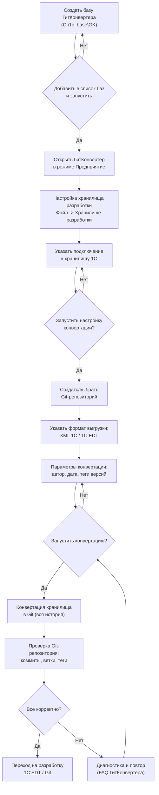

# Миграция хранилища 1С → Git через 1С:ГитКонвертер

> **Блок-схема необходимых действий для переноса хранилища разработки 1С в Git.**
> Инструмент: **1С:ГитКонвертер** (база `C:\1c_base\GK`).
> Создано: 05.09.2026

---

## Диаграмма: Миграция хранилища 1С → Git (flowchart)



```text
Diagram: Миграция хранилища 1С -> Git (flowchart)

[Создать базу ГитКонвертера (C:\1c_base\GK)]
        |
        v
{Добавить в список баз и запустить?}
        |-- Нет --> [Создать базу]
        |-- Да
        v
[Открыть ГитКонвертер в режиме Предприятие]
        |
        v
[Настройка хранилища разработки: Файл -> Хранилище разработки]
        |
        v
[Указать подключение к хранилищу 1С]
        |
        v
{Запустить настройку конвертации?}
        |-- Нет --> [Указать подключение]
        |-- Да
        v
[Создать / выбрать Git-репозиторий]
        |
        v
[Указать формат выгрузки: XML 1С / 1C:EDT]
        |
        v
[Параметры конвертации: автор, дата, теги версий]
        |
        v
{Запустить конвертацию?}
        |-- Нет --> [Параметры конвертации]
        |-- Да
        v
[Конвертация хранилища в Git (вся история)]
        |
        v
[Проверка Git-репозитория: коммиты, ветки, теги]
        |
        v
{Всё корректно?}
        |-- Да --> [Переход на разработку 1C:EDT / Git]
        |-- Нет --> [Диагностика и повтор (FAQ ГитКонвертера)]
                      |
                      v
                  [Запустить конвертацию?]
```

---

## Пояснения к шагам

| Шаг | Действие | Примечания |
|---|---|---|
| **1** | Создать базу ГитКонвертера | Путь `C:\1c_base\GK`, конфигурация из `.cf` |
| **2** | Добавить в список баз | Реестр `ibases.v8i` — запись «ГитКонвертер» |
| **3** | Открыть в режиме Предприятие | Интерфейс конвертации |
| **4** | Настройка хранилища разработки | Файл → Хранилище разработки |
| **5** | Указать подключение к хранилищу 1С | Адрес хранилища (файл/сервер) |
| **6** | Создать/выбрать Git-репозиторий | Локальный или удалённый (GitHub/GitLab) |
| **7** | Указать формат выгрузки | **XML 1С** (классический, версия ≤ 1.0.5) или **1C:EDT** (совр.) |
| **8** | Задать параметры конвертации | Автор, дата, теги версий конфигурации |
| **9** | Запустить конвертацию | Перенос всей истории коммитов в Git |
| **10** | Проверить результат | Коммиты, ветки, теги, история |
| **11** | Переход на 1C:EDT / Git | Разработка через Git |

---

## Примечание о формате

- **XML 1С** — поддерживается версиями ГитКонвертера **до 1.0.6** (последняя — **1.0.5.8**).
- **1C:EDT** — современный формат (актуальные версии **1.0.6+**, последняя **1.0.8.4**).

_Диаграмма создана по руководству навыка `mermaid-diagrams` (graph + ASCII-sidecar)._