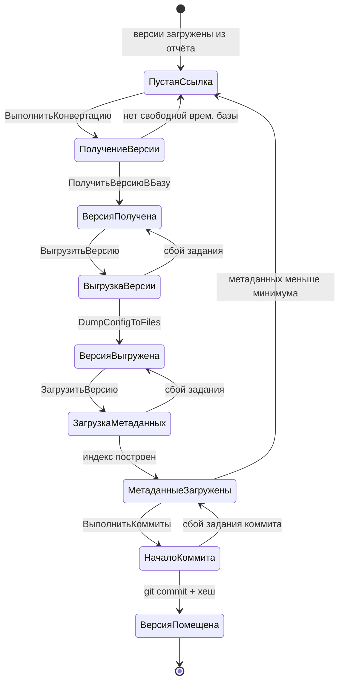

# Состояния версии хранилища (машина состояний конвейера)

> Документ описывает перечисление `СостоянияВерсии`, жизненный цикл версии при конвертации хранилища 1С в Git и переходы между состояниями.
> Координаты кода актуализированы **25.09.2026**. Основной модуль: `cfg_src/gitConverter/CommonModules/КонвертацияХранилища/Ext/Module.bsl` (далее — **КХ**).
>
> См. также блок-схему конвейера: [BLOCKSCHEME.md](BLOCKSCHEME.md).

---

## 1. Где хранится состояние

| Что | Объект | Назначение |
|---|---|---|
| Текущее состояние версии | реквизит `Справочник.ВерсииХранилища.Состояние` (тип `ПеречислениеСсылка.СостоянияВерсии`) | Единая точка правды о стадии обработки версии |
| История смен состояний | `РегистрСведений.СостоянияВерсии` (независимый, периодический) | Пишется в `ВерсииХранилища.ObjectModule.ПриЗаписи` при смене состояния; используется отчётами и проверками по времени |
| Указатель «докуда закоммичено» | реквизит `Справочник.ХранилищаКонфигураций.ВерсияВGit` | Код последней помещённой в Git версии |
| Прочие «связки» | `ВерсииХранилища.Источник`, `.КаталогВременныхФайлов`, `.ВыгрузкаИзменений`, `.Хеш`, `.ВременнаяБаза` | Служебные реквизиты, влияющие на переходы |

Перечисление: `cfg_src/gitConverter/Enums/СостоянияВерсии.xml`. Дополнительно есть пустое значение `Перечисления.СостоянияВерсии.ПустаяСсылка()` (состояние «не задано»).

---

## 2. Соответствие состояний

Порядок — как объявлено в `Enums/СостоянияВерсии.xml`.

| № | Код значения | Синоним (UI) | Роль | Что означает | Кто / где ставит |
|---|---|---|---|---|---|
| — | *(ПустаяСсылка)* | — | «не начата» | Версия ещё не взята в работу (или сброшена для переполучения) | сбросы: `ПрочитатьСтруктуруВыгрузкиВерсии` (КХ:1781), `ПроверитьСостоянияЗаданий` (КХ:413), `ПолучитьВерсиюВБазу` (КХ:3341), `ОбработатьОчередь` (ОбработкаОчередей:170) |
| 1 | `ПолучениеВерсии` | Получение версии | процессное | Идёт получение версии из хранилища во временную базу | `ВыполнитьКонвертацию` (КХ:238) |
| 2 | `ВерсияПолучена` | Версия получена | готово к выгрузке | Версия получена из хранилища, ждёт выгрузки конфигурации | `ПолучитьВерсиюВБазу` (КХ:3421); восстановление из «ВыгрузкаВерсии» (КХ:375) |
| 3 | `ВыгрузкаВерсии` | Выгрузка версии | процессное | Идёт выгрузка конфигурации версии в файлы (XML/EDT) | `ВыгрузитьВерсию` (КХ:1291) |
| 4 | `ВерсияВыгружена` | Версия выгружена | готово к загрузке | Файлы выгружены, ждёт загрузки метаданных | конец `ВыгрузитьВерсию` (КХ:1488); восстановление из «ЗагрузкаМетаданных» (КХ:379) |
| 5 | `ЗагрузкаМетаданных` | Загрузка метаданных | процессное | Идёт импорт в EDT (опц.) и чтение/загрузка метаданных, построение индекса | `ЗагрузитьВерсию` (КХ:1504) |
| 6 | `МетаданныеЗагружены` | Метаданные загружены | готово к коммиту | Индекс построен, версия готова к git-коммиту | `ПрочитатьСтруктуруВыгрузкиВерсии` (КХ:1769); восстановление из «НачалоКоммита» (КХ:403, КХ:745) |
| 7 | `НачалоКоммита` | Начало коммита | процессное | Формируется git-коммит (копирование файлов + запуск git) | `ВыполнитьКоммиты` (КХ:764) |
| 8 | `ВерсияПомещена` | Версия помещена | завершено | Коммит сделан, хеш записан — версия сконвертирована полностью | `ВыполнитьКоммиты` (КХ:875) |

Ключ к чтению: значения 3, 5, 7 — **процессные** состояния-маркеры (из них система умеет автоматически выкатываться назад при падении задания); 2, 4, 6 — **готово к следующему шагу**; 8 — **успешное завершение**.

---

## 3. Логика по шагам

**Прямая цепочка одной версии:**

```
ПустаяСсылка
  → ПолучениеВерсии       ВыполнитьКонвертацию: выбрать версии-«пустышки» и получить их
  → ВерсияПолучена        ПолучитьВерсиюВБазу: ConfigurationRepositoryUpdateCfg во временную базу
  → ВыгрузкаВерсии        ВыгрузитьВерсию: DumpConfigToFiles → файлы
  → ВерсияВыгружена
  → ЗагрузкаМетаданных    ЗагрузитьВерсию: [импорт в EDT] + чтение выгрузки, построение индекса
  → МетаданныеЗагружены
  → НачалоКоммита         ВыполнитьКоммиты: подготовка/копирование файлов, git commit
  → ВерсияПомещена        хеш коммита записан
```

**Роли методов и регламентных заданий:**

| Метод / задание | Модуль, координаты | Что делает |
|---|---|---|
| `ВыполнитьКонвертацию` | КХ:20–266 | Оркестратор: получить все готовые версии (Пустая→ПолучениеВерсии), запустить коммиты |
| `ПолучитьВерсиюВБазу` | КХ:3308–3429 | Получение версии из хранилища во временную базу → `ВерсияПолучена` |
| `ОбработатьВерсию` | КХ:1105–1116 | Последовательно `ВыгрузитьВерсию` + `ЗагрузитьВерсию` (режим без очередей) |
| `ВыгрузитьВерсию` | КХ:1283–1491 | Выгрузка конфигурации версии в файлы |
| `ЗагрузитьВерсию` | КХ:1498–1513 | [Импорт в EDT] + `ПрочитатьСтруктуруВыгрузкиВерсии` |
| `ПрочитатьСтруктуруВыгрузкиВерсии` | КХ:1633–1795 | Чтение выгрузки, индекс, → `МетаданныеЗагружены` |
| `ВыполнитьКоммиты` | КХ:587–893 | Коммит версий, начиная с `ВерсияВGit`+1: → `НачалоКоммита` → `ВерсияПомещена` |
| `ОбработатьОчередь` | `ОбработкаОчередей/Ext/Module.bsl` | Режим очередей: операция «Выгрузка конфигурации» (ВерсияПолучена→…), операция «Загрузка метаданных» (ВерсияВыгружена→…) |
| Регл. задание `КонвертацияХранилища` | — | Периодический вызов `ВыполнитьКонвертацию` |
| Регл. задание `ОбработкаОчереди` | — | Периодический вызов `ОбработатьОчередь` |

---

## 4. Переходы-сбросы (восстановление после сбоев)

- `ПроверитьСостоянияЗаданий` (КХ:309–433): если фоновое задание не активно —
  - `ВыгрузкаВерсии` → `ВерсияПолучена` (КХ:374–377) + перезапуск `ОбработатьВерсию`;
  - `ЗагрузкаМетаданных` → `ВерсияВыгружена` (КХ:378–380);
  - `НачалоКоммита` → `МетаданныеЗагружены` (КХ:403) + перезапуск коммитов;
  - `МетаданныеЗагружены` при недоборе метаданных → `ПустаяСсылка` (КХ:409–413).
- `ПрочитатьСтруктуруВыгрузкиВерсии` (КХ:1774–1792): метаданных меньше минимума → `ПустаяСсылка` (переполучить).
- `ВыполнитьКоммиты` (КХ:730–746): падение процесса коммита (`НачалоКоммита`, лог отсутствует, файлов ровно `КоличествоМетаданных`, прошло > 20 мин) → `МетаданныеЗагружены`.
- `ПолучитьВерсиюВБазу` (КХ:3336–3342): нет свободной временной базы → `ПустаяСсылка` (отложить).
- `ОбработатьОчередь` (`ОбработкаОчередей:165–172`): после загрузки, если не `ВыгрузкаИзменений` и `КоличествоМетаданных` меньше минимума → `ПустаяСсылка`.
- `ВерсииХранилища.ObjectModule.ПриЗаписи` (строки 33–34): при состоянии ≠ `ВерсияПомещена` реквизит `Хеш` очищается.

---

## 5. Блок-схема



Пояснение: состояния 3, 5, 7 (`ВыгрузкаВерсии`, `ЗагрузкаМетаданных`, `НачалоКоммита`) — временные «в работе»; из них при сбое фонового задания происходит автоматический откат к предыдущему «готовому» состоянию (2, 4, 6 соответственно).
